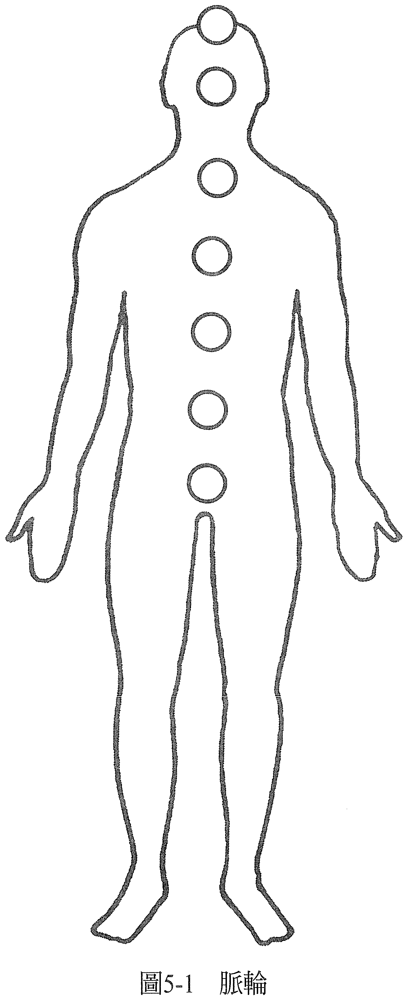

# 第 5 章 脉轮

脉轮的原文「chakra」是梵文，意为「轮子」或漩涡，指的是七个能量中心，你的意识、能量系统就由这些能量中心所构成。意识代表所有你能经验到的一切。你全部的感知、领会、思维过程……所有你能达到的生命状态，都发生在你所谓的意识里。

意识可以分为七类，分别与一个能量中心或脉轮有关。

你的意识是一个能量系统，由不同密度的能量构成流动或运动的状态。当能量流动得很顺畅，你会觉得很健全。当能量受阻，你会经验到紧张，紧张可能会以病症的方式显现。脉轮就像帮浦（pump，泵）或是活栓，调节流经你能量系统的能量。因此，你意识的能量流动状态也会受你脉轮的状态所决定。

脉轮的运作会反映出你回应生活状况时，选择做出的决定。当你决定如何思考、要有什么感觉，你要用哪一种认知的过滤器来经验周遭世界，你就在开、关这个活栓。当然，重点是要让所有的活栓都顺畅地运作，就像笛子上的活栓一样。当你的意识对人生的某件事还残留紧张，这个紧张就会影响能量系统的活栓流畅运作，活栓可能会就此「卡住」，无法灵活开关。

脉轮和气场一样，都是一种意识的面向。脉轮的密度比气场稠，不过没有像身体那么密集。它们有如扎实的能量球，与身体相互穿透，就像磁场与身体可以相互穿透一样（见图 5-1)。

每一个脉轮都和一种内分泌腺有关，也和某一群神经，也就是神经丛（plexus）有关。当你经验到意识的某个部分很紧张，你会在与这部分有关的脉轮里经验到这个紧张。然后，紧张就会传输到和这个脉轮有关的内分泌腺，这个内分泌腺会分泌荷尔蒙，改变身体的化学作用。因此，意识的改变会造成身体化学作用的改变，而改变的内容则视当时的需要来定。

例如，如果你穿过森林的时候碰到一只熊，觉得生存受到威胁的感知，会刺激肾上腺分泌，让身体准备好战斗或逃跑。和生存相关的感知与红色脉轮有关，即所谓的海底轮（Root Chakra），肾上腺就和此脉轮有关。所以我们可以说，当你感到生存受到威胁而产生了紧张，你会在红色脉轮里经验到这个紧张，红色脉轮会把紧张传送到肾上腺，肾上腺就用分泌肾上腺素的方式来回应你感受到的威胁。

紧张也会透过这个脉轮被传送到相关的神经丛，因此，会传送到身体里由这个神经丛、这群神经所掌管的部位。红色脉轮透过荐神经丛（sacral plexus）掌管双腿。就上述的例子（遇到熊）而言，我们可以说，因为觉得生存受到威胁而产生的紧张，会从红色脉轮透过荐神经丛传送到双腿，双腿就充满能量，可以拔腿狂奔。因此，身体的紧张和意识里的紧张是有关联的。我们可以用这样的方式，把身体视为内在意识的地图。

你现在就可以来做一个练习：想象一个如今或曾经让你感到一些紧张的情况。当你想着它的时候，一边感觉你的感受，并注意你是在身体的哪里感受到这个紧张。

如果要你在这个身体部位上画圆的话，这个圆有多大？

如果要你想象这个圆的颜色，你会把它想成是什么样的颜色？

如果要你形容你在这个圆里经验到什么样的身体知觉，你会如何形容（例如你可以这么形容：这个紧张阻碍了能量流，这里在阻碍能量流经你的能量系统）？

如果你能阻抗能量流，那你也能移除这个阻抗，有意识地放松你一直以来紧张的地方。你愈这么做，就能感觉到这个身体部位正在重新放松下来，就能愈来愈通畅地让能量流过，最后你会感觉到自己清爽且舒服，重新成为能量流无碍的通道。

你感受到紧张的原因，决定了你会在哪里感受到它。所以，如果阻抗是在会阴的部位感觉到的（也就是在肛门与性器官之间），那是因为你意识中的紧张与安全、生存以及信任有关。对大多数的人而言，这代表他们和金钱、家庭还有工作的关系。如果阻抗是在腹部的位置感受到，那么紧张就关乎食物、性方面的认知。如果是在太阳神经丛的位置感觉到，它就关乎权力、控制、做自己的自由方面的认知。

如果是在心脏的位置感受到紧张，这个紧张就和你对爱、亲密关系的认知有关。如果是在喉咙的位置感觉到，那这个紧张会存在，是因为你有一件想表达却没有表达的事。

如果你是在额头感觉到紧张，这是因为你有一种真实的自我没被看见的感觉，大家只看见你所扮演的角色。若你是在头顶感觉到这个紧张，是因为当你想连结的时候却感到疏离，或当你想独立的时候却感到牵绊，或是你和权威之间出了问题。

如果上述的话有准确描述出你的感受，那就可以说你的意识感觉到紧张，而你在呈现你意识的能量中心（脉轮）里，经验到了这个紧张。你其实一直都能够感受你的脉轮，只是没有人教你用这种方法去检视你所经验到的。

脉轮的研究已经进行了数千年之久，通常是为了它们玄妙的意义，以及它们所代表的特殊意识状态——那些普遍被认为是超凡的意识状态。不过，在此我们也可以看到，它们也有非常务实的日常用途：透过身体让我们看到自己的意识经历了什么。

当意识（所以也包括脉轮）里的紧张达到某种程度，或是持续了一段时间，这个紧张就会从神经群传导到身体里受其掌管的部位。结果，由这些神经群掌管的身体部位还有其功能，就可能会受到影响。你可能会出现一些症状，如果你用「是你创造出这些病症的」观点来描述这些症状的话，它们反映的就是你如何对待自己。

每个脉轮都和一个特定的自然元素、感官、及体内的某一个系统有关。意识里的紧张得要累积到一个程度，才会导致身体的症状。所以说，我们可以透过解读这些症状来了解，是意识的哪些部分感到紧张、是哪个部分需要改变，就能让个体回归健全的状态（详情请参本书第六部之附录 1「脉轮疗愈指引」）。

务必记得，脉轮只是意识的一部分而已，决定脉轮要有什么状态的，是你。你一边在发生于人生中的情况里穿梭起舞，一边决定你要如何回应。你因而让脉轮或开或关，像音乐家开关笛子的活栓一样，在开关着脉轮的活栓。显然，不要让一个活栓卡在开或关的状态里是很重要的，因为这会让你一直卡在以往的回应模式所招致的结果中。

只有当所有的脉轮都自由无碍地发挥该有的功能时，你才能有意识地检视生活中的每一个情境，决定在当下做出什么适合的行动，并选择如何回应。然后，你就真的自由了。

这表示，你内在拥有一种意识状态是你可以随时接通的，它会让你感觉到很健全，让你活在最佳状态之中。我们把这种状态称之为「完美」。

你经验到这种状态以后，或许会继续活到任务完成，活到你选择离开这个星球的那一天。不过在那之前，重要的是，你选择要经验到什么样的自己，是要舒服（安适）？还是要不适？还有，你选择要等待多久才要回归完美，活在最佳状态里？

如果你到目前为止都一直有些症状，那么你就可以下定决心去做一些能让你重归平衡的必要行动，并且提醒自己没有治不好的病，因为决定要让意识（因此也包含身体）变得怎么样的，是你。

虽然有许多走在灵性成长道路上的人追求成道，但要记得，成道并不等于完美。有些成道的人依然还有病症，这表示他们并没有经验到自己全部的意识、没有经验到整个能量系统皆清明无碍。也有些人生活在完美的状态里，但他们可能没有体验过所谓成道的状态，这也只表示这些人让本能发挥出来而已。

虽然脉轮常与各种灵修法门、加速演化的过程有关，但我必须说明，这里只把脉轮当成意识的地图来探讨，当成可以用在能量疗愈技术里的方法。目的就是当有需要时回归平衡，并充分了解意识的运作，好让我们可以常保平衡，并接受这就是我们与生俱来的状态。

有人说，要快乐，关键就是踏上不执着的道路，避开爱或憎恶的执念，它们会让你无法淋漓尽致体验当下生活以及当下带给你的一切。

爱的执念是要拥有某个东西，而憎恶或负向的执念是要没有某个东西。两者都是执着，在意识里都可能以「一心悬念」的方式出现：一心想拥有，或一心想闪避。强烈到意识里出现紧张，成了念念不忘的悬念，就像上瘾一般。如此一来，执着就成了一种紧张的形式，一直隐身在幕后，可能会干扰你体验当下——这个你身所处的此时与此地。

当你执著于某物，但你并不拥有它，你便心情不好，你感觉到的抗拒程度表现出你的执着或上瘾程度。执着可以存在于任何一个脉轮里，当脉轮持续感到紧张，就表示你需要化解生活中的某事，来纾解这个紧张，或是需要放下对某事的执着，好享受此时此地的生命。

本书的最后几章会描述如何释放这些爱或憎恶执念的方法。我们总是根据你现在发展的状态来进行疗愈。假如你是一年级，那我们唯一在意的问题是你是否有足够的能力发挥这一级该有的功能；假如你是研究生，我们唯一在意的依然是你是否能在这个我们称为「生命」的永恒学习体验的层次上发挥最佳的功能。

运作顺畅的地方，就不用管它。

不顺的地方，就疗愈它。

——在这个世界上，一切都可以疗愈！——
