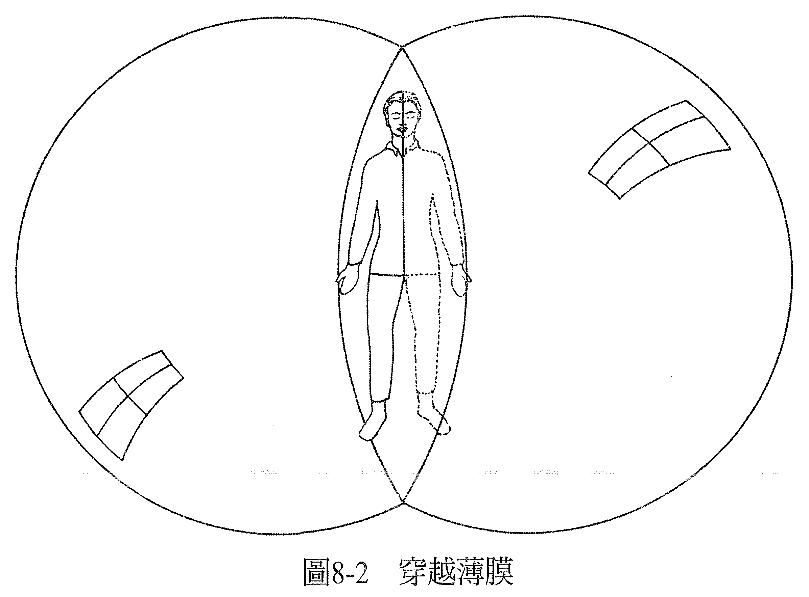

# 第 8 章 穿越

每个脉轮都像一种镜头，你选择透过它来诠释外在的事件。你总是可以选择要用哪一种滤镜来解析外在事件，是安全感、感官的满足、自由，还是力量、爱、表达，又或者是丰盛、性灵、合一。

当你透过某个滤镜或脉轮去看，就仿佛你身处在一个被这种滤镜染色的泡泡当中，所有进入你意识的资讯，都必须通过这个泡泡。然后你就会觉得，你的认知似乎反映了放之四海而皆准的事实，而且你所见的每个人，驱使他们的动机也在同一个脉轮之上。

例如，当你在某一刻主要的考量是安全感，这时你会是透过红色脉轮去看世界。你会觉得每个人看起来也都好像受到安全感的驱使，或是因缺乏安全感而担惊受怕。你不见得有看到真正的世界，你看到的是「你」。

当驱策你的动机改变了，你的滤镜也会跟着改变。比方说，当驱动你的是感官的满足，这时和从安全感的滤镜来看时相比，外在事件的意义又变得不一样了。或许你注意到，有的时候你满足了感官的欲望后，隔天早上，你对事情的看法变得多么不同，令你讶异。

你一整天都在各个脉轮里游走，从不同的滤镜去看世界，至于会是用哪个滤镜，端看你当时选择的是哪一种动机。你的电视里一直有七个节目在上演着，七种显而易见的剧情，你随时都在选择要收看哪一个节目。重要的是，不要让任何一个频道停滞或受到干扰。当你透过紧张的脉轮去看，这份紧张就会扭曲你所见的画面。消除紧张以后，扭曲也会随之消失。和看电视一样，若你不喜欢正在观看的节目，你可以换个频道，决定由不同的脉轮来观看、换个剧情。

可以说其中一个脉轮是你的「根据地」。当你选择人生的某一个时期要以何者为主要驱动力，你就决定了你是以哪一个脉轮为根据地。你可以看看在这个时期里，对你而言最重要的是什么，你行事的主要理由为何，就知道哪一个脉轮是你的根据地了。

你从根据地出发，游走在其他脉轮，至于是哪些脉轮则视你当时的动机而定，然后你又再回到「幕后」的意识状态，也就是你的根据地中。当某一刻的你没有遇到特殊的状况把你的意识带向别处，你的意识就都会停驻在这里。

一旦你改变了人生主要的驱动力，你根本的意识状态就会产生变动，而这必然是因为认知上也发生了相应的改变。而要从黄色脉轮（太阳神经丛脉轮，或说是力量中心）移动到绿色脉轮（心轮，或说是朝气蓬勃的爱的中心），需要一个特别大的转变。很多人会觉得这两者脉轮之间仿佛有道阻膜，在身体的层面上，这层膜大约就在横膈膜的位置。

在这层阻膜之下有三个较低脉轮，社会的标准会认为它们的认知是「正常」的。所谓正常的认知，就是以安全感、感官满足和权力为主的观点。反之，较高脉轮的认知常被认为是异于平常，是不寻常或神秘的意识状态。

前面我们提过，脉轮呈现的是七种振动频率次第分明的排序，因此，世界上其他次第排列的七种振动频率，都可视为一种灵魂演化的象征，阐述与我们意识有关的事。音阶的七个音符（Do、Re、Mi、Fa、Sol、La、Ti）就是七种频率按顺序构成的组合其一，每个音符可与一个脉轮有关。特定的音高会振动相应的脉轮，引发特定情绪。

音符和音符之间又有精确的数学关系，它是一种数学的级数。不过，在这套数学级数中，却有两处表现得不太一样：级数不直接往上增加。例如，在那达瑜伽（Nada Yoga）中，每一音符被分成好几部分；Do=4 拍，Re=3 拍，Mi=2 拍，Fa=4 拍，Sol=4 拍，La=3 拍，Ti=2 拍，Do=4 拍。所以是 4-3-2-4-4-3-2-4，以此类推。在 Mi 和 Fa 之间，以及在 Ti 与下一音阶的 Do 之间的音域均有音变。

因此我们可以说，在黄色脉轮与绿色脉轮之间会发生音变，在紫色脉轮之上也会。根据哲学家葛吉夫（Gurdjieff）的说法，若将脉轮视作人类演化的展现，那这两处可视为冲击点（shock points），是我们在演化的过程中必须突破的阻膜。这过程也许艰辛、也许平顺，端看我们选择什么样的认知而定（见图 8-1）。

要通过黄色脉论与绿色脉轮之间的阻膜，就必须改变认知，才能让爱的认知变得更明晰。要通过紫色脉轮之上的阻膜，就必须有新的认知能化解在独立自主还是服膺权威之间，显而易见的矛盾或冲突。

一个人决定穿越任何一层阻膜的时候，都要花一点时间，所有的认知才会跟上他想演进的决定。在这段期间里，他会愈来愈认同那些新的优先顺序，作为他做决定的基础。同时，他也会继续回应那些因着内心深处的决定而在生活中引发的情事（疑是“事情”）。

黄色脉轮的认知可能和要控制还是要自由有关，绿色脉轮的认知与爱及接纳有关。从黄色脉轮移动到绿色脉轮的人，如果过去一直活在控制之中，而且在决定要更敞开心胸接纳之后，依然继续紧守控制不放，就可能会遇到一些困难。可能他们生活中的事情会看起来愈来愈失控，仿佛世界末日到了，毁灭迫在眼前，直到他们终于放下控制，敞开心胸接纳。

有的时候，为了刺激他们敞开心胸接纳，会有一个冲击强迫他们放手。这个冲击可能是身体上，也或者是情感上。当它是情感上的，而且非常强烈，这个人可能会经验到所谓的「精神崩溃」，心智的认知过程崩解了，整个人觉得失控。传统治疗也许会让这个人找回他「正常」的认知，但对这个正在演进的个体而言，却不见得是最好的。

较好、较快也较容易的做法是：鼓励这个人去关注那个感觉比较好的新认知，那他就会觉得这个灵性过程是一种突破，而不是崩溃。

然后，当他从新的角度来看生命，他就会明白，是他执著于控制的程度让事情变得辛苦。他会看到他就是这样在创造出自己的不舒服，还有自身的痛苦。他会用慈悲之心看待自己（一直以来的样子），会不再觉得需要捍卫对他已经没有意义、而且事实上也已不复存在的生活方式。

当这个过程极度难以穿越时，这个人或许会觉得好像快要死掉了。虽然这感觉是真的，但并不会危急性命。它只是一种发生在意识里的过程。这个人虽然以前对自己有某种认定，但又同时渴望能用新的角度看事情。若要用新的方式让事情产生意义，就表示旧的显然已经不具意义了。死的是过去的生活方式。

如果这个人坚持紧守旧的认知、旧的化身，那他也许会觉得整个过程就像「小我之死」。只要他还维持旧的认知，以旧的认知来看待他正在放下的事物，那他就会真的有死掉的感觉。如果把焦点转移至当下，放眼未来，这个人就会发觉新的生活方式正浮现出来，同样一个过程却会让他觉得彷若重生。

可以把这视为从一个实相前进到另一个实相，从一个泡泡前进到另一个泡泡的过程。如果把它们想象成两个互有接触的肥皂泡泡，就可以把两个泡泡交接面的薄膜，当成我们之前提到的阻膜（见图 8-2）。

旧泡泡里有些认知，是这个人所认为的自己。他可能会说：「这就是我，虽然我用这些认知来定义我自己，不过现在我想让事情出现不同的意义。」

有了这种改变的欲望后，他开始走出原来的泡泡，朝下一个泡泡前进。他来到两个泡泡交接面的薄膜，这时候，虽然事情在旧的面向已经没有意义，但也尚未出现其他有意义的新面向。落在这时间片段里，在穿越两个泡泡之间的薄膜产生的能量场时，他们的认知也许会很混乱、困惑，这种情况要到进入新泡泡以后才会结束。

若这个人用过去的认知来看事情，用从前有意义的方法行事，那也是没有用的。如果他这么做了，他会发觉有哪些事物是他必须放下的。这时候的关键就是要把这个过程视为一种突破，放眼未来，用新泡泡的认知去看事情。

如此一来，新的认知就会出现，从新的实相之中崭露。事物开始有了意义，但是和以往的方式不同了。走向新泡泡的动作会持续，这个过程会继续，这个人会用新的认知来定义自己，体验到重生的过程。在穿越时遇到困难的人，可能会感到在太阳神经丛和心之间的薄膜处，有些身体上的郁闷感，甚或很严重，不过如果做能量疗愈的话很快就能被释放掉。

如果这个人的太阳神经丛脉轮一直都在活出自由，而不是掌控，那这个过程进行起来会温和许多。从自由转移到接纳，会比从控制转移到接纳容易得多。从自由移向接纳的时候，这两组新与旧的认知在意识上，并不会有那么极端的冲突，穿越阻膜时的认知也不会那么混乱，经验到的会是温和且合理的演化。

也可以用星球群体意识的角度来看这个穿越的过程，星球群体意识是由地球上全体人类的意识所构成。据说这种群体意识也可以有脉轮，和其他任何一种意识一样，也据说它正在进行属于自己的演化，其他任何一种意识亦然。

这个群体意识在每一个脉轮上都花了两千年的时间，全世界发生过的事件都可以反映出群体意识正处于哪一脉轮。过去两千年以来，我们生活在双鱼座时代，也就是黄色脉轮的时代。当时的历史事件都与权力或控制有关，每个国家都只在意自己的问题还有利益，导致规模史无前例的战争。人们已经发展出足以毁灭自己许许多多次的武力。

两千年以前，一位众所周知的伟大存有耶稣在地球上生活行走，他代表的是心轮或绿色脉轮，这在当时是非常罕见的。当他看向四方，他看到的是黄色脉轮有明显失调的迹象（皮肤是黄色脉轮掌管的其中一个部分）——痲疯病横行，那是一种让脸部溃损的皮肤问题。这些症状的存在、人要把脸遮起来的动作，都表示人是因为生命隐含罪恶感，才会创造出这些身体症状，为此我们能了解，这位伟大的存有耶稣，他渴望的是让人类能从自找的无谓包袱中解脱。

如今，我们已经进入某些人口中的宝瓶时代，也就是心轮、绿色脉轮的时代，周遭的状况正迫使我们去关注从绿色脉轮出发的认知。比方说，我们创造出了爱滋病，它就是这个时代的一种状况。虽然医界一直在为这种疾病寻找身体上的解决方法，另一方面，另类治疗界却已经透过改变个人对爱的认知，在治愈这种疾病上小有所成。

现在各国也较有全球意识了，更在意我们身为全球共同体所扮演的角色。人们看事情的时候必须超越国土疆界，过去的冲击与当前令人义愤的情事，正驱使我们做一些和以往不同的事。

虽然仍有部分的人们尚未穿越，他们的认知一直让他们看到全球性的灾难，但或许可以把这些视为是用来刺激全球共同体意识的提升——假使这个提升没办法以一种较温和的方式促成的话。

也可以把这些认知看作是人从黄色脉轮的过滤器来看时，自然会产生的结果，但它必然会让路给全球意识的新认知，变成从绿色脉轮演化得较高的角度来看，人会体认到：为了让自己的需求得到满足，也必须满足他人的需求。

由于这一切是发生在全球性的层面上，所以也包括在群体意识里愈来愈多的个体身上。有愈来愈多的个体正从黄色脉轮通往绿色脉轮。愈多的存有完成穿越，对其他群体意识的影响就愈大，有助加速整体穿越，直到完成为止；我们就能够成为一个全球共同体，良好地运作，每个成员都能找到一起和谐生活的方式。如此一来，疗愈就完成了。

那时候，若真有一个更大的共同体是由许多存有所组成，而人类及地球上的生命只是其中一小部分的话，我们还能做到让他们亲近却不感威胁，或许这表示我们已经做好准备积极加入他们那个共同体。

——在这个世界上，一切都可以疗愈！——
