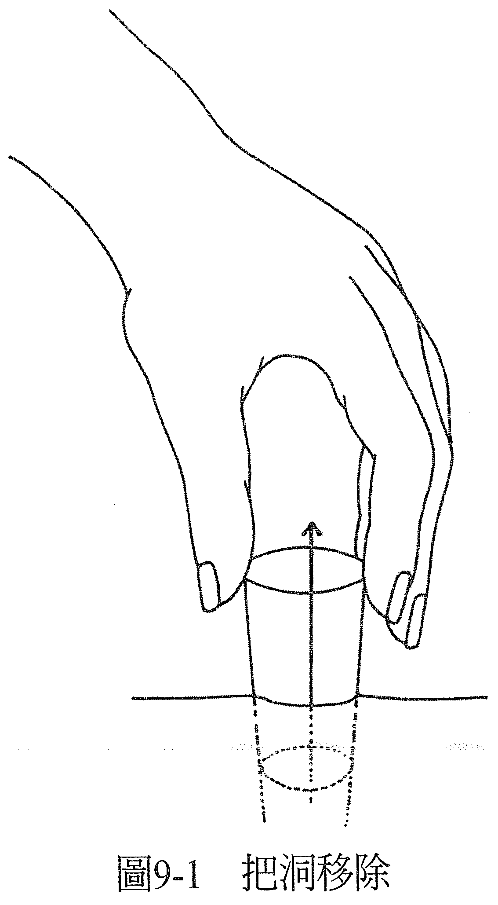
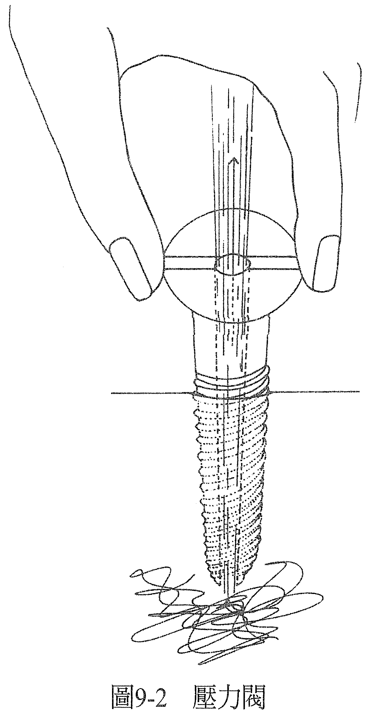
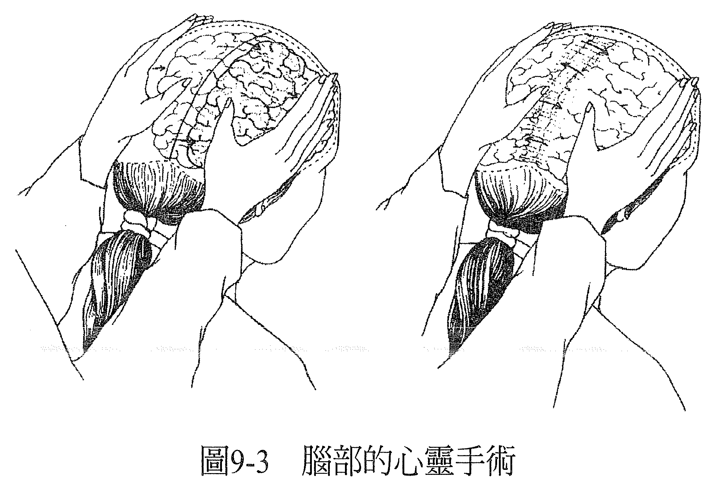

# 第 9 章 思想形式

当人们不觉得自己是健全的，感到生病了，有时他们会把症状描述成一种物体。他们可能会说：「觉得头顶仿佛压着一个重物」，或是「身体的某边插着一把利刃」。就他们的感觉而言，那里确实有个东西，感觉起来非常真切，仿佛真的存在于物质宇宙一样。

在进行疗愈时，我们会把这些想法看作一种物体，而且真实存在。它们在所谓乙太的层面上以思维的形式存在，乙太是物质宇宙与灵性宇宙的交会处。从玄学、灵性宇宙的角度来看，物质宇宙就投射在乙太这个基质上。我们的思想、目标，我们的意识创造出的画面、我们注入意识的画面，据说都会进入乙太，有如全息图像一般，待时机成熟，就会显现在这个物质世界里。

做疗愈的时候，能量治疗师在得到案主许可后，会进入他的灵性宇宙或泡泡，助他重回健全的感受。凡是案主经验到为真的思想形式，能量治疗师也会经验到它是真的。若案主经验到「仿佛有重物压在头上」的感觉，能量治疗师可以把这个重物视为真实的物体。

可以说在乙太的层面上，这个思想形式是由能量所构成的。能量治疗师能够看到并感受这股能量。他用愈多的感官去专注感受那个思想形式的存在，就愈能让自己觉得它很真实。当这个思想形式对治疗师与对经验到这个症状的案主来说，都一样真实时，治疗师就能够把这个思想形式移除，案主便不会再感觉到它。当案主感到这个思想形式离开了，他就能重回健全的感受。如果说，基于这个症状与他经验到的思想形式有了生理上的支持，而症状和思想形式都已解除，他不再感觉到它们的存在，那么这个生理支持必然也会跟着不复存在。

如果案主感到头痛，有如头上压着重物，身为能量治疗师的你可以决定要看到并感受到这个重物，当你经验到它是真的，你就有能力移除它。然后，那个叫做头痛的经验就不会再被感受到。案主会感觉它离开了，他恢复健全了。如果这次头痛有生理上的支持，那这个生理支持一定也同时会被移除。

如果案主说「觉得像利刃一样」，那么利刃就一定存在。你可以决定去感受到它、看见它，然后从案主的感觉中把它移除。这样，疗愈就发生了。

在做的时候，你一定要把这些东西当成是真的。举个例子，把刀移走以后，你可以想象那里剩下一个洞，然后你必须处理那个洞。你可以把洞填起来、合起来、缝起来，甚至把洞也移开。毕竟，洞也是一个东西。如果我们一开始做的时候，案主的身上就有一个洞了，然后我们移除了这个洞，案主身上就没有洞。他们就完整了。

在万有的乙太层面上进行疗愈时，是没有任何限制的。你要想象什么样的故事都可行，要坚持让自己相信你知道你正在想象的那个故事。如此，疗愈就能发生。萨满的能量治疗师就是这样在做治疗；把症状看成石头、虫、或其他的东西，接着从身体里移除，在心中创造出「已经治好了」的感知。菲律宾和南美的心灵手术（psychic surgeon）也是用这种同样的方法做治疗（见图 9-1）。

当你把这些东西视为真实，要从案主身上移除的时候，你必须处理掉它们。因为你用来形容感受的语言会创造你的实相，所以你可以决定当你把这个东西丢到地上的时候，它会于两秒内消灭，而且你可以看着它消灭。或者，你可以决定要让这个东西回归到万物本源的大能量球中，或是若你决定要拿着这个东西时，你可以用其他的方式重新诠释你拿着它时经验到的感知，例如把它诠释成是对疗愈有帮助的耀眼白光。

回到前面的例子，你把洞从案主身上移走，让他变得完整后，你可以把这个洞留起来，收进口袋里。假如你日后治疗其他的人，比方说在他的心附近有一座巨大的石墙，你就可以把洞从口袋里再取出来，放到墙上使用。然后，墙上就开了一个洞，你可以透过它去接触对方的心。洞可以是很有用的工具。在这个层面上，显然你拥有无比的创造力，想怎么做、要怎么想象、用什么来帮忙解除案主的这个症状都可以，只要你愿意让自己相信你所想象的故事就行了。

若你把疼痛想象成能量流动不顺的感觉，是因为内部压力太大，需要释放，那你可以用压力阀来缓解疼痛。你可以用这种方法迅速纾解任何一种疼痛，尤其对治头痛特别有用，不管这头痛在那里多久了（见图 9-2）。

压力阀看起来可能像是一把中空的钻子，钻入这个人感到有压力的地方。当压力阀碰到这个地方以后，你可以看着压力往外释放，发出咻一声案主会同时感受到这股释放。虽然这次这个思想形式是由身为能量治疗师的你的意识中开始，但你和案主都能一同感到它是真实的。

做完后要记得把压力阀拿起来，因为下次还可以再用。

思想形式可以按照案主所形容的症状来进行，把症状当成一个物体，然后能量治疗师就来处理这个物体，这很重要，因为在案主的意识当中，就是这个东西阻碍了他，令他无法感觉健全。

思想形式也可以由能量治疗师来发想，只要能吻合案主的描述即可。例如，能量治疗师可以把无法灵活运动的膝盖看成「生锈了」，所以用乙太油来治疗这位案主。思想形式可以是治疗师想象出来的物体，用来帮助纾解症状，例如压力阀。

如果治疗师知道解剖学或生理学，也可以派上用场，让有缺陷或运作不良的器官得到修复，例如帮「发炎」的肌肉灭火、唤醒「麻痹」的器官。

运用这些思想形式，也可以帮助人脱离依赖，无论是对药物、观念还是关系的依赖。在英文里，当遇到依赖或上瘾的情况时，我们会说这个人「被钩住了」（hooked），一旦他们无法得到想要的东西，就会变得很不舒服，不舒服的轻重反映出他们被钩住的程度。当他们觉得不舒服的时候，这感觉也会发生在身体的某个地方。当你看入案主的这个地方，你可以看见一个钩子，然后把它拿掉。钩子被拿掉以后，案主就不再被钩住了。

当然，这要在案主也由衷希望走出瘾头时，才会有效。如果他们并不出自本心，只是因为刚好有人想帮他一把就随他去处理，那与发自内心由衷认为受够了上瘾而且准备好放下的人相比，效果当然不会那么好。

就连是对药物或毒品的上瘾，钩子也会出现在其中一个脉轮里。记住，问题不在于药物或毒品，而是喜欢上瘾的性格，是这种性格一心一意地想要得到药物。于是钩子会出现在真正有瘾头的地方，或许真正上瘾的是安全感或权力等，然后，治疗师就可以把钩子从这个地方移除。

即便从脉轮的定位来看，需要的是垂直的健全形态，因为人是沿着一条垂直轴线达到所有脉轮的平衡，但有些人需要的是横向的平衡，也就是说，他们的男性面和女性面之间不平衡。这种情况可能会显现成一边的身体有惯性的症状或瘫痪，或是双眼不协调，或闵读障碍，明显可以看出大脑的左右两方彼此并不「交谈」。

当阳性脑和阴性脑之间没有对话，通常代表母亲和父亲之间没有沟通。如果父母之间有极度不和谐的对立情事，不难想象小孩会有多么难熬。为了与父母其中一方取得连结，他们不得不和另一位切断关系。这样的小孩很难同时对两种能量敞开心房。

针对这种情况，我们可以做一个快速的脑部手术来化解它（见图 9-3）。

身为能量治疗师的你可以低头看着案主的头，想象你看到左右两边的脑。你想象其中一边的脑进入了另外一边，在那里待一段时间，然后再出来。接着你把相同的这个过程反向再做一次。

如此一来，虽然原先存在一道墙，但现在，两边的脑都有机会去体验另外一边，然后沟通的可能性就会出现。起初，这个症状是基于两边的脑之间没有对话，但在现在的状态下，症状就可以解除了。

虽然这里提到的例子有些听起来或许很荒唐、难以置信，好似笑话，但全都是有能量治疗师正在使用，而且有效的。我们相信，只要一个人可以做到，人人都可以做到，每一个我们认为不凡的人，都只是让我们看到自身能力的范例而已。我相信，你也能成功运用这些手法，至于有多成功，端看你愿意相信的程度如何。

毕竟，凡你信为真者皆为真——对你而言。

——在这个世界上，一切都可以疗愈！——
