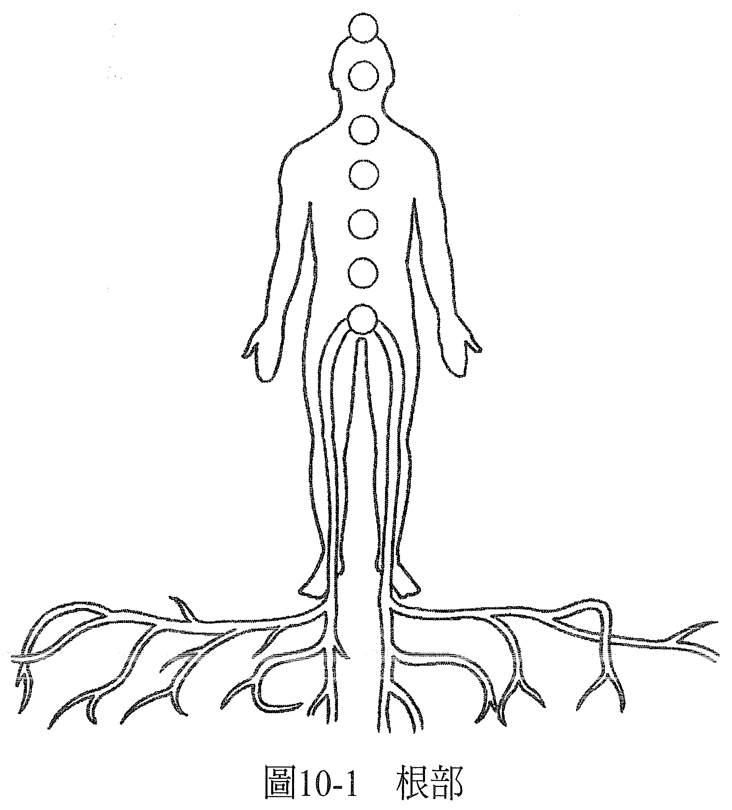
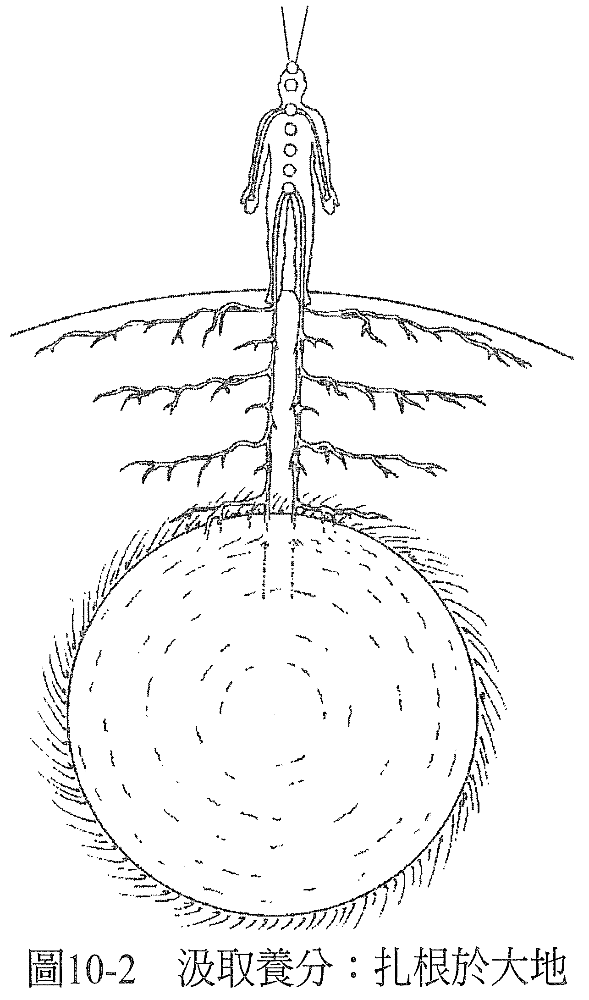
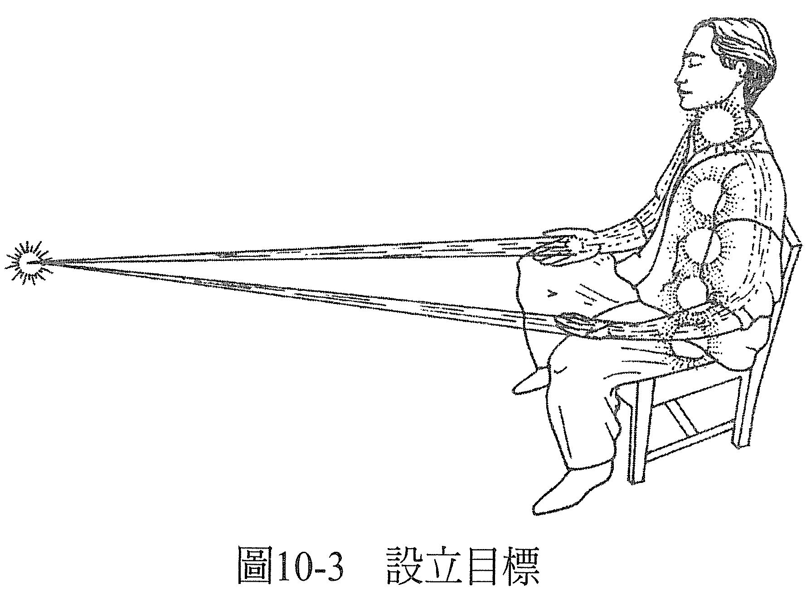
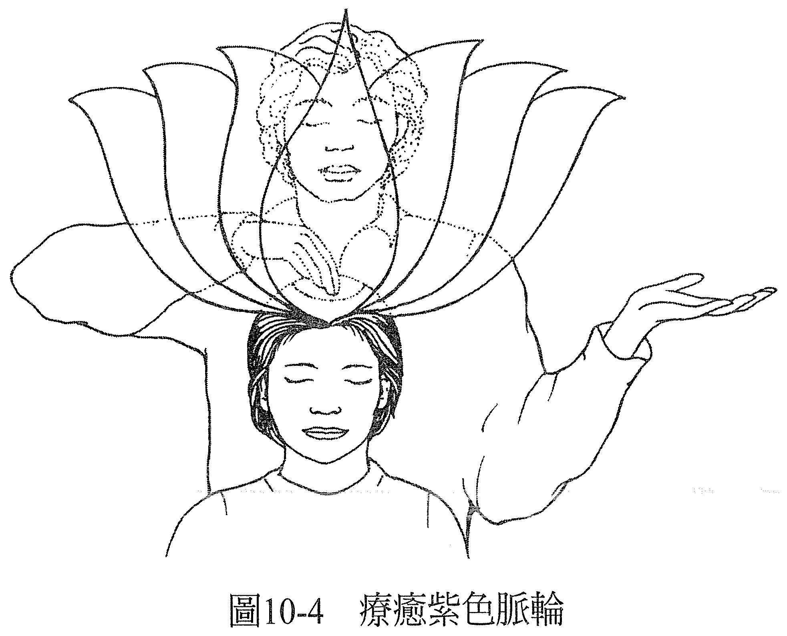
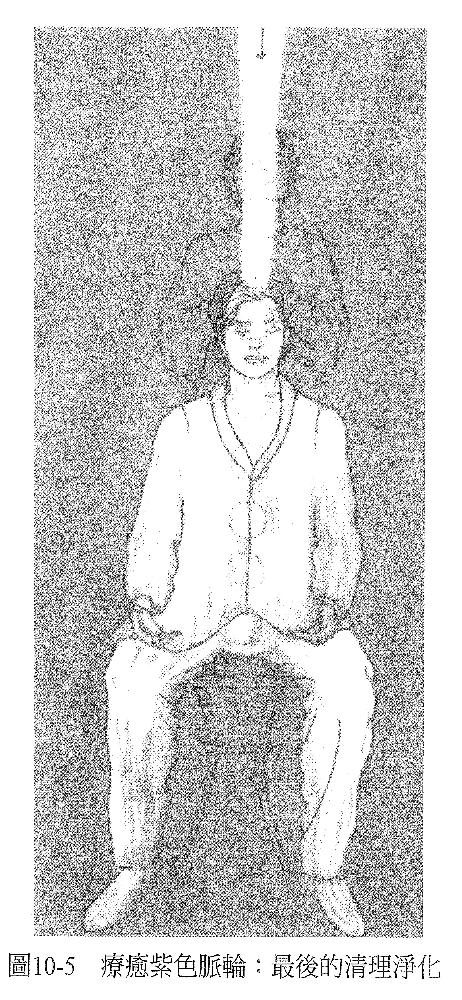

# 第 10 章 根部，枝干，顶端

当你感到自己很健全，你不只是在脉轮的层面上都能保持均衡，你也能透过红色脉轮整合与大地的连结，并且能敞开地接受和紫色脉轮有关的宇宙能量。

在进行能量疗愈的时候，若红色脉轮是均衡的，可以请它把根往下传送，到案主的腿再进入大地，并观察这么做以后会发生什么事。你看到的画面会显示案主是否愿意从有用的来源取得滋养，就像植物愿意把根扎入大地，并合理地预期这么做会令它的需求获得满足一样（见图 10-1）。

当根不愿意往下来到腿部，表示案主不愿向外寻求满足需求的方法，而这种只想自给自足的态度不仅没有必要，也没有帮助。当然，在必要的时候自给自足是件好事，可是若在非必要的时候坚持，可能就是反映过往的经验令他产生抗拒，这种抗拒对案主没有好处，只反映出了他们打从心底相信：就算真的向外连结，他的需求也不会得到满足。

注意：疗愈一定会与案主的平衡状态，还有他们真正的样貌、现在进化到哪里有关。因此，除非他们的较高自我（也就是内在存有）想让治疗师看见需要改变的地方，否则是不会显现给治疗师看的。无论如何，在疗愈结束后，治疗师和案主都会觉得原本可能是问题的，已不复存在。

假使左右两只腿都有抗拒，反映出了基本上他并不相信自己被允许可以从任何地方获得滋养。若只有右腿，反映的是他不信任向男性寻求滋养是可以的，若只有左腿，则是不信任向女性寻求滋养是可以的。

如果这个卡住的地方已经存在好一阵子，可能反映的是和案主的母亲或父亲有关的基本信念；若是比较近期才有，能量治疗师可以和案主一起检视他有哪件生活事件可以对应到症状最早出现的时间点，然后应用上述的解释去看。总之，能量治疗师要持续鼓励根部往下走到腿和脚，移除任何出现在途中的阻碍，不管是看着根部自己移除障碍，或是透过处理思想形式的方式都好。

当根部走到脚掌时，治疗师可以想象案主的脚掌下出现了能让根部如鱼得水的画面，可以是森林、农场、花园、田地，或任何有营养的沃土处，根可以轻松自如地深入。每当不滋养的画面冒出来时，能量治疗师就必须改变它。

不管出现什么画面，呈现的都会是当时案主对于生活在地球上的感觉，以及（或是）案主与身为营养能量泉源的母亲之间的关系。也可能代表案主当时和家里的关系，或是与安全感、生存、信任有关的问题。

根部底下有石头的话，虽然显示出一种踏实的感觉，但不很滋养。出现大海，表示案主相信代表安全感的东西都会把他淹没，或是陆地上没有他的家。火山则表示他相信地球上的生活充满了令人措手不及的意外。深邃的空间表示案主和母亲或滋养来源之间有距离。

能量治疗师可以改变任何一种不是最好的画面，例如透过移除障碍改变画面的细节（改冬为夏、改黑夜为黎明、改沙漠为绿洲等），或是把根部移到更欢迎它的景色里（从墓地移到公园、让船靠岸、改变地理位置等）。当身为能量治疗师的你这样做，你就是在改变案主意识里的一个画面。这画面原先呈现的是对他们没有帮助的信念系统，但你把它变成了会带来成果的画面。

当场景是最佳状态，你可以请根部深入大地，这时最棒的画面应该是——地心有一个很滋养的球，正红色，当根一碰触到它，它马上就会被根吸往地球表面，沿着腿往上，进入红色脉轮（见图 10-2）。

（最初）这样的场景反映的是案主与身为滋养来源的母亲的关系，（结果）也反映了案主与一般滋养来源的关系，无论是金钱，还是是否允许内在存有获得滋养。

还是一样，若出现的场景并不是最棒的，你可以改变它，如此一来，案主就会经验到意识有了转变，很多人在做完后都说：脚掌的知觉不一样了，与大地更有连结感，也更临在于身体里。

和请求红色脉轮扎根到大地里的做法一样，你也可以请蓝色脉轮将枝干从双臂延伸出去（蓝色脉轮和表达有关）。这时候，你会看到案主的信念，他们的意识里对于表达自己的需求和感受，当他们取得并拥有自己想要的、能让他们快乐的事物时，他们有什么感觉。

枝干不应只停留在手掌处，应该要继续以蓝色雷射光的形式延伸出身体，于案主前方会合。这会显示出案主设立目标的能力，以及当他这么做的时候他认为会发生什么事。蓝色脉轮和乙太有关，实相就投射在乙太这个基质上，它也是物质实相与灵性实相的交会处，所以蓝色脉轮代表他们实现目标、在物质世界中把目标创造出来的能力（见图 10-3）。

若雷射光没有延伸到手掌之外，表示案主懒得设立对自己重要的目标，反正他们也不相信这么做就会成功。当这种情况出现在能量疗愈时，反映出的并不是对案主的真实，也不是真正的他们该有的平衡，更不是他们目前演进的程度。而这需要改变一下。

若光束没有集中在同一点，可解释为案主的渴望并无法让他们快乐。那么，能量治疗师就要像用车灯打光一样，为光束打光，直到两束光都集中在同一点为止。距离应该要是治疗师觉得「对」的距离。较近的代表近期的目标，较远的代表远程的目标。最佳的情况是案主有能力设立任何时期的目标。

看着能量光束沿着手臂往下流动，将能改善影响肩膀和手臂的症状，而看着根部沿着双腿往下长，将能改善影响腿部的症状。

在处理紫色脉轮的时候，能量治疗师要先看到它处于最佳状态，也就是清欢的紫色能量球，然后治疗师一边触碰紫色脉轮顶部，一边请紫色脉轮打开，看看它打开的时候会发生什么事。

最佳的情况是——紫色脉论从顶端开始展开，美丽的紫色花瓣一片接一片舒展，宛如莲花绽放。如果不是这样，能量治疗师就需要移除某个处在这里的障碍了（见图 10-4）。

因为紫色脉轮代表的是案主最深层的意识，所以当它展开时，你可以从紫色脉轮一路看穿到红色脉轮。如果看得穿，就请求白光从上方进入紫色脉轮，直通至案主的脚趾为止，然后从脚到头将他充满。当白光来到一个脉轮，这个脉轮就焕发着该有的光芒，比以往都还要耀眼清澈。等白光满溢紫色脉轮，它就会环绕着案主，同时将他充满，这时候，能量治疗师就知道疗愈已经完成了（见图 10-5）。

最后一个画面应该是案主充满了白光，每一个脉轮都耀眼地焕发着它天生自有的色彩，根部从地心汲取养分，蓝色的雷射光从掌心发出，交会在案主前方的某处，而他的顶轮宛如莲花绽放般，白光继续流入案主，溢满他浑身上下。然后，案主应该会觉得和做疗愈之前相比，感觉颇不一样。问他看看吧！看看疗愈发生到什么程度！

——在这个世界上，一切都可以疗愈！——
