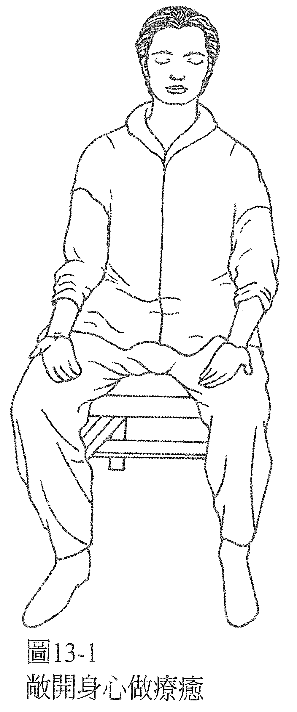
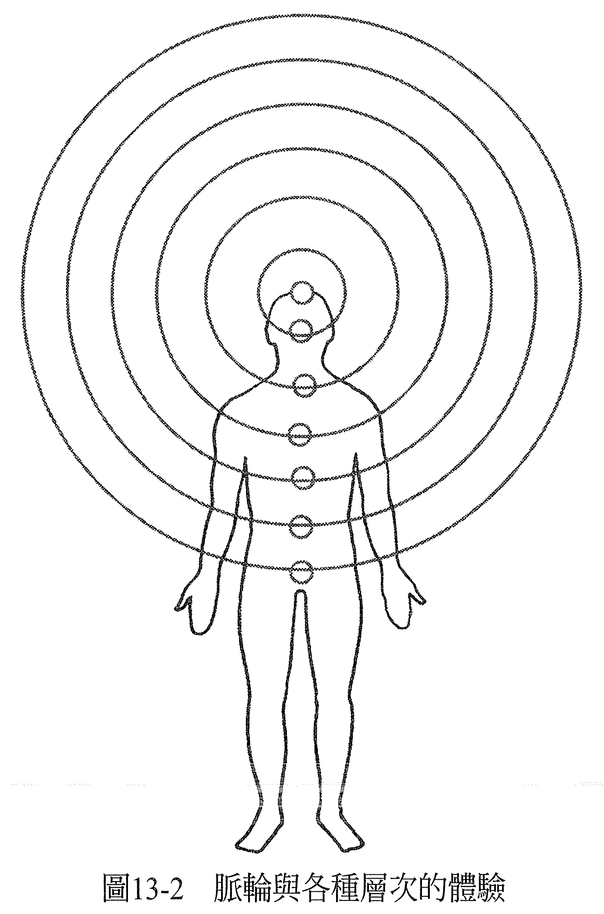

# 第 13 章 接受能量疗愈

有一个故事：一个女人得了癌症，医生告诉她只剩两个礼拜可以活了。她去菲律宾找一位心灵手术治疗师，他帮她做了治疗，告诉她她已经好了。她不相信，两周后，她还是死了。可是做解剖的时候，医生没有在她身上找到任何癌症病兆。

对每个人而言，认知会创造出实相。当然，对接受治疗的人（案主）而言是如此，对能量治疗师而言也是如此。当我们把能量疗愈看成一个共同创造的过程，就会发现：案主若不是会干扰疗愈的过程，就是会在他自己的意识里创造出最佳的环境，让疗愈得以发生。在接下来的两章里，会探讨案主（被疗愈者）这一方的认知，以便支持疗愈的过程，增加成功的机率及程度。邀你透过案主（被疗愈者）的眼睛来体验疗愈的过程。

当我们提到「认知」的时候，指的是你（也就是案主）选择去想或感受什么，是你去选择如何诠释一些事件。现在我们都知道，总是有选择在。

被疗愈者可以被动地允许疗愈发生，或主动地助长这个过程。你不一定要真的相信当下发生的事，或是相信能量治疗师他的实相架构，你只要不挡路就行了。重要的是，开一扇门，让好事有机会发生。例如，你可以说：「好吧，反正试试看也不会怎么样，说不定还会有好事发生呢。虽然我不懂，但它可能会有帮助。」那你就是被动的，但你敞开心胸，愿意接受疗愈。
想更主动的话，你可以增强「你的疗愈「此刻」正在发生」的这个认知。

## 1 准备

当能量治疗师和案主在互动的时候，最好的情况是案主主动请求治疗。有时好心的朋友或亲人会帮案主找能量治疗师做治疗，但这不一定是当事人本身的意愿或渴望。有时候，案主并不认为能量疗愈是必要的，或是因为某些原故，他不觉得和能量治疗师一起进入疗愈过程是一件自在的事。这点必须要尊重他。

帮一个不想得到疗愈的人进行能量疗愈，就好像在对牛弹琴。你会浪费时间，牛也会觉得烦。

是案主请求疗愈的话，有可能是他们自己先开口提出请求，也可能是能量治疗师先释出提供协助的意愿，而他们也想接受。如身体不舒服，能量治疗师会问你：「我可以帮你什么吗？」或：「我是做能量疗愈的，我可以帮你吗？」你或许会回答你希望能够痊愈。也可能是你主动去找能量治疗师，请求疗愈。

表达想痊愈的渴望时，最好要清楚直接，不要只是暗示。就像能量治疗师与案主在签约一样，协定好要做一件事来满足案主的需要。话说得愈直接明白，案主就愈清楚他身体经历的事，还有（或是）意识需要的改变。比方说，如果你有痔疮的问题，不妨就直说出口，不要说：「呃，我的红色脉轮有点小问题。」若你有爱滋，你也要直接说明，表达出你渴望痊愈，期望它发生。换言之，通常案主若能明确地告诉能量治疗师他哪里需要疗愈，这样效果会最好，而且要尽量开诚布公、直接、清楚、扼要。

「我想痊愈」这几个字就表示有需要进行一次疗愈。你承认在你身上、你的人生有个地方没有如你所愿，你也接受了这就是你在疗愈之前的情况。你承认这次的疗愈是你想要的，你希望这个状况能够改变，而且你已经准备好让改变此刻就发生。

你也是在表达出你期望它现在就发生。当案主请求做一次能量疗愈，能量治疗师就会接受，期望它发生，在做能量疗愈的动作时，要和共同参与这次治疗的存有创造出一致的目标及意念。

这部分完成以后，就好像电影开演了，而结局也已经知道了。电影的结局就是疗愈已经开始，只是还没有演完。有点像看庞德的电影，在你坐下来以前，你就已经知道结局了好人赢、坏人输，世界得到拯救，庞德抱得美人归（通常是在床上）。

虽然每次都一样，但我们还是坐了下来，对于这次会怎么演感到兴致盎然。能量疗愈也有点像是这样，结局已经确定了，疗愈已经发生在未来，剩下的就只是要把它演完，看着它在物质的外在实相里显化。意念已经确立。当这些准备工作做好了，真正的疗愈形式就可以开始进行。

不同的能量治疗师有不同的疗愈方式。有些人喜欢请案主躺着或坐着，让他们保持放松和敞开。当然，任何能量治疗师要求的姿势，都是可以让疗愈发生的。但如果遇到意外事故，有能量治疗师在现场的话，这时候伤者需要坐在椅子上还是躺在床上？是否要有柔和的光线、点香、放音乐、保持安静……才能展开疗愈？就不适合由能量治疗师来决定了。不过，除了这类急救的情况外，能量治疗师是可以决定要用哪一种方式进行对他是最好的。

身镜系统倾向采用的姿势是：案主坐在没有靠背的椅子上，让治疗师可以接触到案主的背部以及脊椎底端。如此一来，案主全身的每个部分都能够被触及（见图 13-1）。

案主坐着的时候，双脚平放在地上，手放在大腿上、掌心朝上，闭上眼睛。这个身体姿势反映的是内在敞开、怀抱正面期待的心态。闭上眼睛，好让案主可以只是专注于当下，敞开心胸接受疗愈。他们向能量治疗师敞开自己的意识，允许自己完全被看见。如果他想要隐藏一部分的意识，不让治疗师看到，就表示他并不想疗愈这部分的意识，或是不想在意识的这个部分经验到健全。全面的敞开会是最有效果的。

## 2 案主对能量治疗师的观感

若你是案主，而你觉得这个能量治疗师根本不知道自己在干什么，或是认为他不会做得最很好，那这件事对你就没有意义了。你不会希望用这个观感创造出这种实相，或是让这个内心想法成真。最明智的选择是：认定这位能量治疗师也许是全世界、有史以来最伟大的能量治疗师，不管他本身是不是知道这件事，他绝对最适合来做本次需要发生的疗愈，而事实上，疗愈也即将发生。

进行疗愈的时候，你该时时提醒自己你的疗愈现在正在发生，这位最适合你的能量治疗师，正在用必要的方法为你疗愈。我认识的能量治疗师都不需要案主在能量疗愈的过程中帮忙。你不用非得观想什么，除了「我完美的疗愈现在正在发生」的意念以外，什么也不用去想。毕竟，如果疗愈你的是全世界、有史以来最伟大的能量治疗师，他当然不需要你帮忙，对吧？

## 3 案主真的期望痊愈吗？

倘若身为案主的你，在现在这次的能量疗愈做完之后，还预期以后要再做一次，那你就不是在希望这一次就让你痊愈。当一个人真心想被治好，他会想要「现在」就被治好。在进行疗愈以前，就先协议必须做好几次的能量疗愈才能解决问题，等于是事先认定了这次不会完全治好。我们比较倾向做一次性的疗愈，而这是有可能的。

做完疗愈的动作后，可能要花到两个礼拜的时间，才会完全体验到能量疗愈的效果，然后可以看看效果是全面的还是局部的，若是局部，就可以再安排一次疗愈，但同样的，也要预期这一次的效果是全面性的。若案主期待做完现在这一次之后，还要去找另外的能量治疗师，那他们也就并不是期望在这次的能量疗愈中痊愈。

如果案主在做疗愈的时候，戴着眼镜或助听器，表示他们预期做完疗愈之后，还会需要用到它们，因此，他们也没有真的期望会得到全面的痊愈。

当你是案主，你应该要预期做完疗愈后，会有一些改变，并且在做完疗愈的那一刻，就迫不及待地去检视看看做完之后，你感受到了什么样的效果。

## 4 完成疗愈

有人帮你做完疗愈之后，你张开双眼的第一个念头应该是：你已经好了！你可以马上帮自己检查身体、意识，或之前受损的感官或功能有什么感觉，留意和先前的相比，现在感觉如何。你的第一个念头应该放在「有哪里不一样了」，也就是觉得比较好的地方，就算只是「比较放松了」也很好。

每当你认同一个进步，其他的进步也会变得明显。你好像正走入一个新的泡泡，每次当你认同疗愈的效果，你就更深入一些。就算只是局部的效果也要认同它，代表你留意到了到目前为止的进步程度。你也要了解，不管你马上注意到的是什么样的进步，它继续发挥效果的机率都会变高，你之后还会留意到更多的效果。说完正面的感受后，你可以告诉能量治疗师还有什么症状有待纾解。通常这时候，能量治疗师会同意把疗愈做完，综合一下他的观感与你所说的感受，看看剩下的症状准备好缓解到什么程度。

举个例子，你可能会说：「我的膝盖感觉比以前好多了，不过还没完全好。好像以前的不舒服感还有百分之三十在。」这时，能量治疗师就可以直接去看觉得不舒服的地方，用他的方法迅速再纾解它。若它很快就消散了，这过程就完成了。不然的话，治疗师可以用第 15 章提到的方法，给你一些反馈（feed back），给剩下的症状一些时间去做进一步的纾解。通常给完反馈后，剩下的症状就会消失，但如果没有，治疗师可以迅速再去释放剩下的不适。

当你说出你认同疗愈、这次疗愈的效果，你就可以把注意力放在「当下」这一刻，你对愈未来的看法会比以往更加正面。在物质世界里，这些以前的状况已得到明显改善的事情，会更强化这个观点，让你愈来愈明显地看到你的疗愈已经发生了。

## 5 做完疗愈后

进行疗愈的时候，虽然能量治疗师必须预期效果会是立即的，但他也必须知道，若当时看起来效果没有全面的话，该如何看待这个情况，同时一边坚信疗愈发生了。这样，身为案主的你，也就是刚才被疗愈的人，就可以对后续的效果怀抱正面的感觉。

做疗愈的时候，能量治疗师与案主双方都在处理深层的意识。疗愈效果必须穿透各层的量体验、每一层意识，直到最后完全显现在身体层面为止。这是需要时间的，不过需要多少时间就不一定了。有些人让疗愈完全显化，可能只是几分钟的事。有些人可能花上好几个小时、好几天甚至好几周，全视案主的敏锐度，以及他们相信的程度而定。一般而言，可以预期在做完疗愈的动作后，全面的效果会在三天到两周之间完全显现。

你能够感受到的最深层的内在体验，是我们所谓的灵魂，与紫色脉轮有关。你最外层的体验是物质身体的层面，与红色脉轮有关。这两者之间是其他剩下的体验层次，它们和不同的意识层次、不同的灵妙体、脉轮有关。

在等待疗愈的效果完全显现的这段时间里，效果会如涟漪般穿透你意识的不同层次，你会经验到意识里有相对应的改变，你的思考方式会改变。新的想法可以进来，让事情产生新的意义，与旧想法有关的紧张则被释放了。

然后，你就可以检视你在周遭世界的互动、你选择回应各种状况的方式，并留意有哪些和以前不同，认同这个过程就是你之前所接受的疗愈在持续发挥效用（见图 13-2)。

身为案主的你，当身体结构重新排列，产生平衡，能量有了新的形态，你可能会经验到的知觉是好像有东西在你身上移动，直到你感受到这次疗愈全部的效用为止。如果两个礼拜后还有任何症状的迹象持续，那你可以就接受到目前为止的疗愈程度，并做好准备去纾解剩下的症状。然后，当疗愈完成，你就可以继续好好生活，埋首其他重要的事，例如活出你的梦想，用自己的方式找到幸福。你好了，不用再做任何处理了。

好了就是好了。

————在这个世界上，一切都可以疗愈！————
