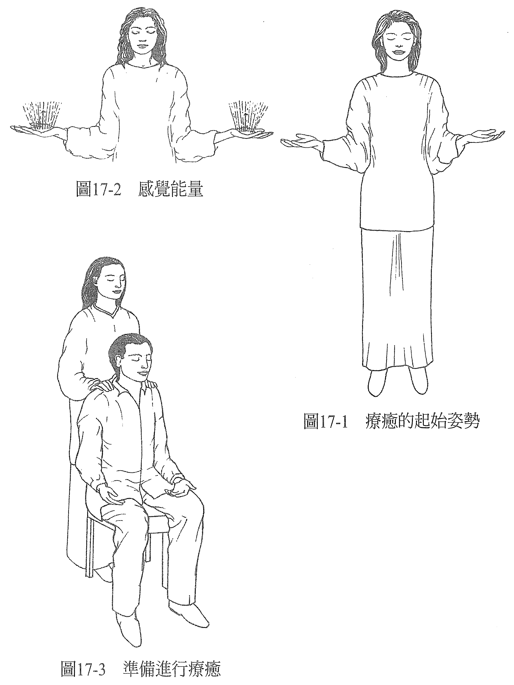
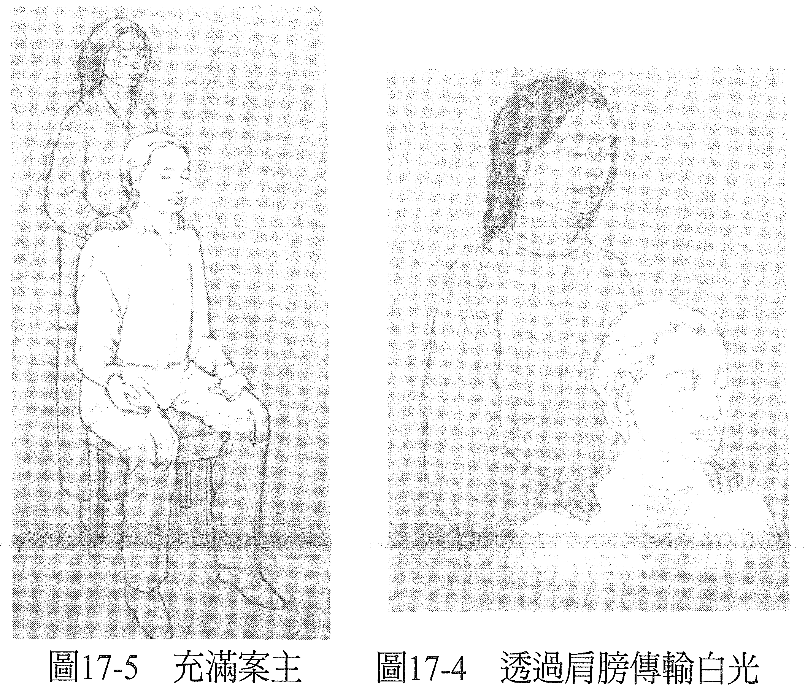

# 第 17 章 用白光疗愈

在这一章，身为能量治疗师的你，会用白光来做找回健全或健康的模型，创造出疗愈已经发生的感知。当你想象案主盈满白光，这会引发案主已经痊愈的感知。

之所以用白光来做治疗，是因为它容易让我们正面联想到纯洁、灵性。此外，白光代表健全，也是因为它包含了光谱中的全部色彩，而全部（完整）就是健康。

想象一支萤光灯管，当能量流通时，它会发光。所以说，白光也可以代表能量正自由自在地流动，这很符合我们对疗愈的定义：纾解卡住的地方，以回归健康的感觉。

若说白光代表能量自由自在地流动，那阴影就代表流动不顺的能量了。如果你在让案主充满白光的时候看到阴影，就知道它仅仅代表紧张状态，要给它照射更多的白光。当阴影遇上光，就只会剩下光。紧张要不是存在于意识层面，就是身体里，或是两者都有。化解阴影表示紧张也化解了。

当然，倘若你感觉到案主的身体里有紧绷（例如肩膀），或是你知道他的身体里有紧绷，那你也会知道当你向内看的时候，你会看到如阴影般存在的紧张。若你没有看到，你就必须调整你的感知，直到它和你所知的身体层面的事实一致。尔后开始的就是：阴影会被化解，紧张得到了纾解，疗愈便能显现。

在典型的白光疗愈里，案主会舒服地坐着，双脚平放在地，双手张开，放松地置于大腿上，闭着眼睛。当然，案主是不戴眼镜或带有任何人工装备的。之后，看见案主敞开心胸准备接受疗愈以后，你就可以展开「疗愈的起始姿势」（见图 17-1），详述见于本书第五部。

感觉到你双手里的能量（见图 17-2）以后，你就知道你现在的意识状态很适合感受能量、让疗愈发生。接着你可以告诉自己，你感受到双手散发着白光。

温柔地把双手放在案主的肩膀上（见图 17-3）。

虽然这不是疗愈过程非做不可的动作，但接触案主确实可以给他一种放心的感觉，也会开启你与他之间某种程度的直接交流。触觉和绿色脉轮（心轮）有关，等于是从体内来连结一个人。肩膀和蓝色脉轮有关，与案主是否有意愿敞开和接受有关。所以，当你把双手放在案主的肩膀上，你可以直接感受到案主对疗愈敞开的程度。

这里要强调一下，在这类的疗愈当中，接触是很轻的、没有压力，不需要去操控对方的身体。

等你的双手焕发着白光以后，就想象你用这道白光透过肩膀充满案主：往上充满头部，再往下穿过身体来到脚趾，也盈满身体、手臂、来到肌肤。这些都是把你的手放在案主的肩膀上来做就可以了（见图 17-4 ~ 17-5）。

若你感觉很难进入身体，（因此）也很难进入到案主的意识，那就在心里默默地对案主说话，以心灵对心灵的方式，就像是在想象中对话，例如：「我是为了疗愈你而在这里的，但我很难进入你，是否可以请你再敞开心房一些，让我用我知道的方式协助你呢？」通常这样说完以后，交流就会变得轻松点。如果还是没有，就用嘴巴直接说出来进行沟通。假如仍然有抗拒，就承认它的存在，让案主知道他需要去找其他的能量治疗师，或是换种方式，或是另外再找时间。

用任何一种你选择的方式，想象自己用白光盈满案主。你可以想象有一种白色的物质流过双手，充满案主。或是想象案主全身上下有数百万根的小萤光灯管，当你双手的能量触碰到身体某个部位里的灯管，这个部位就发亮了。

假如把手放在案主的肩膀上时，你感觉到他的肌肉紧绷，你就知道当你看的时候，你会看到阴影。阴影就是紧张。你不需要按摩案主的肩膀，只要从双手散发白光，看着白光化解阴影，一如加热灯管融化冰块一样。如此，你会感觉到案主的肩膀在你的掌心里放松下来，而且是自然的，不是因为你施以压力。

当案主在充满白光的时候，如果你看到了阴影，就去想象你用光化解了它，并记得这些阴影是在哪里感知到的。做完疗愈以后，你可以用反馈的方式（见上一章）告诉案主这个讯息，他就会知道，在哪里感知到的紧张已经纾解了。

当你看到案主全身上下都充满并散发着白光，你就可以创造出「疗愈已经发生」的感知。这时候，疗愈已经完成了，你要告诉案主你做完了，「等你觉得差不多了，就可以张开眼睛。」然后等待案主的反应。

你已经创造出「疗愈已经发生」的感知，现在你需要知道案主认同这个感知到什么程度。你可以透过询问案主来找出答案：「感觉如何？有什么不一样吗？」他要回答你这个问题，就得检视当下的感受、和以前的相比较。你要让他把到目前为止的正面感知第一时间说出来。

如果案主不是这么回答你，就把他的注意力引导到当下这一刻的感受，鼓励他说出到目前为止他所察觉到的任何正面疗效，事实上那就是真实。

那之后，如果还有某种程度的症状存在，案主可以说出来，你可以再请他像之前那样，敞开心胸，迎接疗愈完成，把白光传送到他的身体里还没有完全觉得顺的地方。

将白光充满这个地方，化解这里觉得不舒服的阴影。完成后，你可以再请案主张开眼睛，再问感觉如何？有什么不一样？

可以用这种方式做到症状完全解除，或是已经花了充分的时间为止，确定这次能量疗愈做到这里，已经尽量发挥了最大的效果。

也可以试试其他的技巧，例如用脉轮或思想形式来处理，是否有助完全解除症状。如果单一技巧遇到瓶颈，结合上述技巧通常可以成功。

要深信正面的效果会持续一段时间，而且事实上，全面性的效果还可能旋即出现。就算抗拒全面且即时地解除症状，但我们认为疗愈一定会发生，所以说出这个抗拒并承认它，亦有助于朝着全面的疗效更进一步。

当你用白光来做急救，案主的姿势就无所谓了，最迫切紧急的是让案主充满白光，减少或消除必须处理的症状。可能的话，可以在触碰案主的情况下进行，因为触觉确实能提供对方某种程度的安心感，这份安心感在紧急情况下是需要的、也是被渴望的，它也提供了一种管道取得自光所提供的健康感。

假如你无法直接碰触案主，你还是可以透过想象让案主盈满白光，在你心中创造出「案主正感觉愈来愈好」的观感；之前觉得是问题的，现在要不是已经完全解决，就是正稳稳朝这个方向前进，而且一直在变好当中。当你能维持这个认知，这个「已经痊愈」的思想形式就会进入乙太，帮助共同创造所谓的物质外在实相，那它也就可以实际在身体层面上帮助疗愈。认知创造实相。

————保持这个认知：在这个世界上，一切都可以疗愈！————
