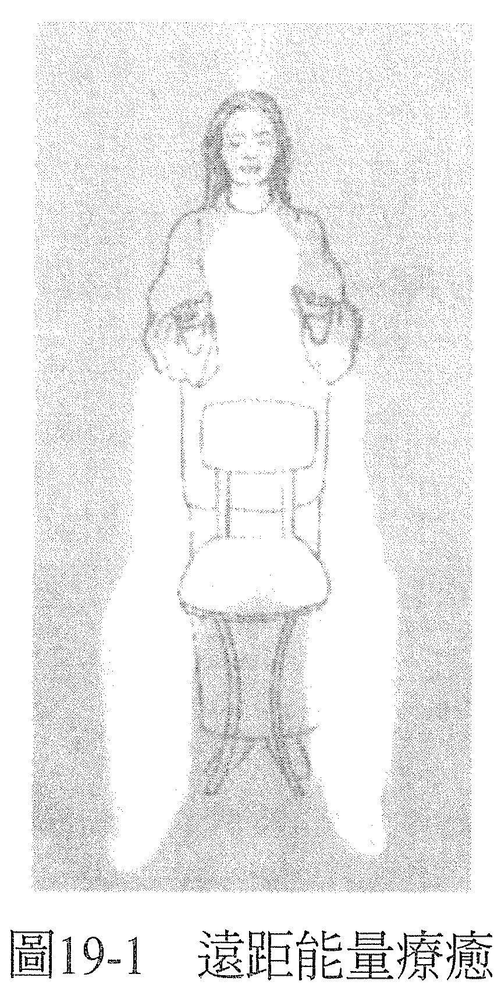

# 第 19 章 远距能量疗愈自我疗愈

凡是可以透过亲身碰触来做的疗愈，也都可以用远距的方式来进行。距离多远不重要，从几公尺到几千公里都有可能。毕竟，你的对象并不是身体而是意识，意识是不受时空限制的。

无论你是用白光、脉轮还是思想形式来治疗，你看见并疗愈的都是这个意识。你的对象是接受疗愈的人在意识中经验到的东西，你的方向是要让他的意识重新经验到健全或健康。然后，透过这次疗愈创造出来的新形态或能量，身体就可以跟着回复平衡状态。

若有不能触碰案主的理由，例如有思想或宗教上的因素，你还是可以用接触疗愈同样的方式进行，只是手没有真的接触到身体，而是从几公分或几公尺以外来做。虽然你知道肢体碰触会增添更多层次的交流，有让案主感到安心的好处，但你也得承认，有的时候肢体接触就是会让案主有种受侵犯、界线被破坏的感受。这个时候，你就必须在心中认定：换一种方式来进行也能达到最大的效益，而且你会有你需要的一切手法和面向，创造出完美的疗愈。如此，这次疗愈也会是完美的。

即便案主亲身坐在椅子上，你从几公厘或几公分以外的距离来进行，你都会有如接触着案主一般，看见你会看见的，只是接触感有所不同，如此而已。

既然你的对象是意识而非身体，所以就算案主并没有亲身坐在椅子上，你还是可以做一样的事。你可以对着一张空的椅子来做，想象案主就坐在那里，你会看到、感觉到案主仿佛就坐在那儿，但你是从几公分以外的距离来做，没有真的碰触到案主。

开始时，你还是要从能量疗愈的起始姿势做起，感受手里的能量，认定它是白光，然后将手放在案主肩膀会在的地方，想象你用白光充满了他（见图 19-1）。

你还是一样会看到案主意识里的画面，因为你疗愈的对象依然是他的意识。如果想有最好的互动，你可以让案主知道疗愈要在几点进行，这样案主就可以有意识地在这段时间里保持敞开，接受疗愈。

若案主没有这么做，疗愈依然会发生在乙太层面上，直到他们敞开心胸去接受良效，那通常是在他们去睡觉以后，疗效就会显现。

当然，告诉案主你看到了什么、做了什么、它对你的意义为何，总是很有用、大有帮助，这样他们比较容易去了解新的意识，感受自身的健全。

你可以用从远距做白光一样的方法，来处理思想形式或脉轮，想象案主就坐在你前面的空椅上。起初，你可能会觉得怪怪的，但只要你一开始感觉到能量在流动，体验到你看见案主的能量系统，也印证了你的反馈，你就会知道，距离并不会削弱效益。你也会知道，你可以用同样的方式疗愈世界上的任何人，无论何时、无论他身处何地。

然而，有些能量治疗师可能会觉得：如果有替身帮忙坐在椅子上进行远距疗愈，会令他们比较自在。也就是有其他的人同意坐在椅子上，代替真正被疗愈的对象，然后，治疗师看见的会是案主本人的能量系统而非替身的。这么做，纵使替身本身并不知道案主本人是哪里需要疗愈，但他们仍旧可以告诉你，在这次疗愈中经历了什么。

替身可能会在自己身上感受到和正在被疗愈的症状有关的东西，或是看到一些你能够理解的画面，因为这些画面与远方案主身上正在被疗愈的东西有关。虽然请他人担任替身，通常都会在有意识的情况下进行，但有的时候，也可能是在你不知不觉中自然发生的。你可能会突然发现你看到并处理的能量系统，根本和你意图疗愈的人——那个坐在椅子上的人毫无相关。你所看到的一切都是对的，但坐在椅子上的人完全无法了解你说的反馈，坐在椅子上的这个人仿佛是同意为别人的疗愈而存在，不过他可能也会从过程中获益。

需要疗愈的甚或是此人人生中，令他焦虑的某人的意识，例如父母或其他的亲人。那么透过坐在椅子上的这个人进行的远距能量疗愈，所产生的效果之一，就是释放了他自己的焦虑。疗愈有很多形式。

到目前为止描述的能量疗愈，都需要能量治疗师和案主之间有一种连结感，所以可以说，只要有相同的连结感，就可以进行其他形式的能量疗愈。因此，你从电话里听见案主的声音，就可以与他的意识产生连结，疗愈就可以用这种方法发生。你还是可以一边想象用白光、脉轮、思想形式来做，一边感受案主的意识，而且即刻听到你的疗愈产生了什么效果。

当然，如果案主是你认识或以前见过的人，那么透过他的照片来做，也可以引发同样的连结感，然后疗愈也可以用这样的方式发生。

若远距疗愈的对象是你从没有接触过的人，你可以用照片来「找到」案主的意识，接着疗愈也可以发生。其实，若你得到的只有案主的名字、一些相关资讯，都足以锁定案主的意识，进行疗愈了。这些资讯或许是案主的症状、年龄或身体特征等。

接着，仿佛你在请宇宙意识帮你找到一个有这个名字和资讯的存有，宇宙意识会带回案主的「地标」给你。然后，你可以进一步问那个提供案主姓名的人，他是否符合一些特征，以确保你找对人了，例如：「这个人是红头发吗？是吗？好，那我们可以开始了。」

有些治疗师因为已经成就某种演化程度，所以颇为了解自己，他们用的又是另外一种远距能量疗愈，叫做神入疗愈（empathic healing）；要做这种疗愈，必要的前提乃是清楚自己是谁、什么是你的真实。

在这种能量疗愈中，你会觉得透过神入感，与案主产生连结，你会感受到案主的经历，仿佛是你的亲身经历一样。你宛如处于案主的身体与意识之中，经历着他所经历的一切。

要知道你所经历到的意识并不是你自己的，你自然就能够了解自己的意识，知道你所经历的紧张并非你自己意识里的紧张。假如你知道你所经验到的感受并不是你的，你可以问它是谁的，然后认出你所穿戴的意识为何人。你可能会发现自己走路或站立的方式，是你所知的案主的方式，或是你会在自己的脸上看到案主的面容。

这时候你就知道，当你像这样连结着案主，当案主经历到症状纾解了，你也会在自己的身上感觉到症状纾解了。

同理，你也可以决定当你在自身意识中纾解了紧张，而你和案主是有连结的，案主也会因此经历到同样的纾解。

显然，这扇门也为其他的远距能量疗愈方法而开，例如能量治疗师的眼光，也就是能量治疗师的眼光选择看见案主是健全的，并坚持认定这样的观感，或只是用意念来疗愈，做法也是一样。

你在这些能量疗愈的领域中做愈久，就会愈来愈明确地知道使用自己的认知、让别人感受到健全的方法，是没有任何极限的。你也会发现，当你可以用意念来影响生理结构，你就能够用自己的意识来改变物质世界的种种。其他能量疗愈的面向也会变得清楚。你会看到一些情况自己冒出来，等你来疗愈它们，你也会看到哪个情况需要用的疗愈方法又是什么，并使用这些疗愈方法。

此外，无论你当时身在何处，你都有办法做到。

有了充分的练习，对自己的主观感受（你做能量疗愈的手法）建立起信任感以后，你在做远距疗愈的时候，也会和做最简单的接触疗愈一样感到自在舒服。

————在这个世界上，没有治不好的病！你什么都可以疗愈！————
