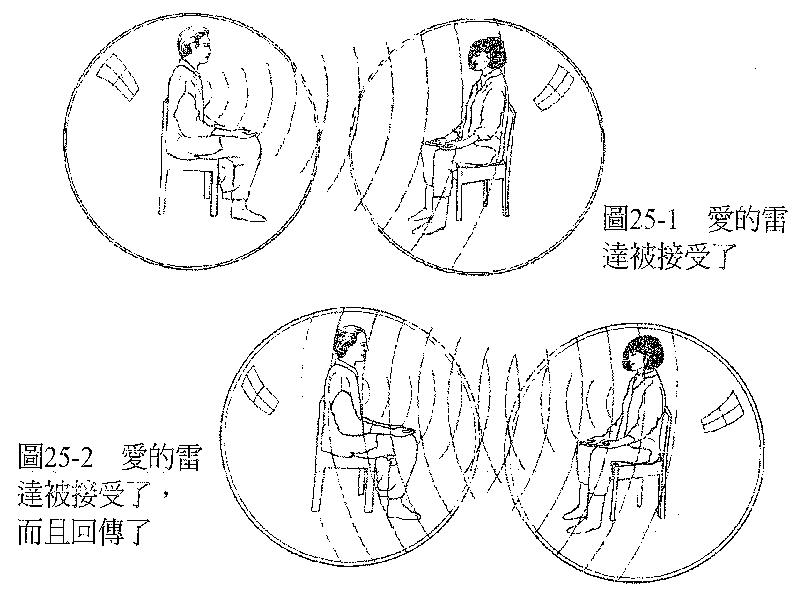

# 第 25 章 爱能让人痊愈

当我们思索这一切的意义、宇宙的本质、自己存在的目的、演化的目的、我们为何会在这里……或许会意外遇见秘传哲学里「我们都是神」的思想。

想象你就是神。你是神，是天上地下唯一的存有，这或许是很孤独的感受。虽然我们会经验到自己就是宇宙的创造者，一切蕴含于自身之内，而且自己不断成长、无限度扩展，也把万化当成自己的延伸一样地爱着，但如果我们不去看到共同创造与连结的话，还是会错过自身意识里的一些面向。

毕竟，我们怎能独断地认定，当我们在身边创造出自己的宇宙时，其他地方不会有另一个神、女神或自有永有本有（all-that-there-is）的存在，在他们身边创造出他们的宇宙？如果有的话，我们又该如何沟通？

杰夫·乐弗（Jeff Love）在他的著作《量子诸神》（The Quantum Gods）一书的序中说得很好：

> 量子诸神是能力无远弗属的存有，但祂们各自单独存在，未意识到其他神的存在，也无法化身为具有创造力的存有。
>
> 量子诸神唯有透过创造出共同的实相，才能意识到自己与自己以外的神。量子诸神签署了一份意向书，将自身存有投入共同创造和构筑实相。是爱驱动祂们签署这份意向书的祂们渴望结束单独的状态，与彼此接触。这个合约是用意念的笔，写在空间的纸上时间是它的墨水，广衰且充满能量。祂们共通的实相由意识所建立，它是一种很特别的意识状态，名叫物质。物质是祂的媒介，存有是祂的讯息。
>
> ……你和我都是量子诸神……

所以说，那潜藏在物质宇宙的创造背后、这个合约的根本面向，就是爱，爱是它的意向。因此，爱是宇宙的「接合剂」，它把一切都接合起来。

我们每个人都是纯粹能量的化身，我们化身的目的就是要让存有演化，而演化必然以爱为基本元素，爱是绿色脉轮的感受。

从这点来看，显然世界上每个人都由爱驱动，有时候还会对没有爱的感觉产生反弹。国家守卫疆界，是对其居民爱的表现。各国团结起来，创造出天下一家的感觉，也是一种爱的居表现。

我们出生的时候，爱不只对我们的身心健全来说是必要的，对生存也属必要。小孩若没有爱和有人要的感觉，就会选择不出生，或是虽然出生了，却有一部分的能量系统受损。其实可以说，每一种症状之所以产生，以及潜藏在人类能量系统中每一种失衡背后的根本原因，都是因为觉得缺少了爱。

我们知道每个症状都代表意识里有紧张，这些紧张表示我们退缩了，没有做真正的自己。这种退缩要不是因为觉得没有爱而产生的一种反应，就是因为别人认为我们「应该」做什么，而觉得如果允许自己展现真我，就会失去爱。要不是因为觉得没有被爱，不值得被爱，就是因为害怕会失去爱，而不让自己真实。

我们常在人生中重复上演一些以前已经演过的剧情。角色也许不同，但戏码没什么两样。遇到这样的情况，我们常会一脸疑惑，自问：「为什么我又看到这种剧情上演？为什么我又要再经历这样的戏码？」

要找到能回答这个问题的答案，我们可以回到第一次看见这出场景上演的时刻。那一刻，这出场景里有些不完整的地方，少了一个元素。如果当时有这个元素的话，这出场景就完整了，就不会在意识里留下问号和不完整的感觉。

这个缺少的元素永远都只有一样，就是觉得「没有被爱」。意识里有一个问题没有得到答案：「如果我被爱的话，这怎么会发生呢？」基本的问题永远一样，虽然细节或许不同：这出剧情若不是和遗弃、受委屈有关，就是觉得自己没有人懂。「如果我被爱的话，这就不会发生了。但它发生了，所以，我是不被爱的。」

只要这个问题一直存在于我们的意识，我们就会重新创造这个剧情，为的是修正这个错误的认知，增补那缺少的元素，好让这个场景圆满，让我们有所领悟、感觉有爱，无论之前是否曾感觉到它。

你也许依然觉得，你之所以会有这些错误的认知是有原因的，例如：「因为我不配有人爱，所以我才没有被爱。」或：「是因为我做错了什么。」或：「我不够好。」等。从你相信这些原因的这一刻起，你就会带着一种能肯定这些错误认知为真的方法生活，直到你改变想法为止。

要修正这个问题，我们可以将那缺少的元素增补到最初的场景里，让它圆满。我们可以加入「我是被爱的」感觉。你可以从这个观点来重新上演这个场景（「如果你的父亲爱过你，那当他不得不离开你的时候，他会有什么样的感觉？」「噢！他一定会非常难受！」），或是发送「爱的雷达」，看看会传回什么。

当这个场景重新上演，加入了我们确实被爱的感觉，曾经坚硬的地方就会融化，感觉更柔软，我们就能够允许那被拒绝已久的爱进入心房。因这个错误的认知而产生的症状，就会纾解了。

当我们很难在心中创造自己被爱的感觉，「爱的雷达」可以帮我们看到爱是存在的。要启动爱的雷达时，想象你身在自己的泡泡里，把爱传送给另一个人，看到他处于「他自己」的泡泡里，然后看看我们传送出去的爱来到对方身上的时候，会发生什么事。对方可能默默接受，也或许很难让爱进入心房，或是会欣然接受，而且在接受了以后，还可能选择把它回传给你。

传送爱的时候，我们可以感觉到对方何时接受并回传了爱。我们是可以看得到的。然后，我们就知道爱存在，而且是从自己的亲身体验深深知道。虽然这种经验很主观，可是当我们和对方面对面聊聊感受的时候，就能证实了。如果很难一个人自己去创造出这种感觉，那么做个疗愈会很有帮助（见图 25-1 ~ 25-2）。

在疗愈的时候，要对案主完全放下评断或期望，这很重要。没有评断或期望的时候，剩下的就是接纳与爱了，无条件的爱。当案主处在接纳他的环境中，他就可以让自己的感知提升到心的层次，同时释放那些之所以创造出和他们来找你疗愈的症状有关的错误知见。他们可以感觉到有了接触，也有了爱，并且知道爱就在那里。

然后疗愈就发生了。

爱能让人痊愈。

————在这个世界上，一切都可以疗愈！————
