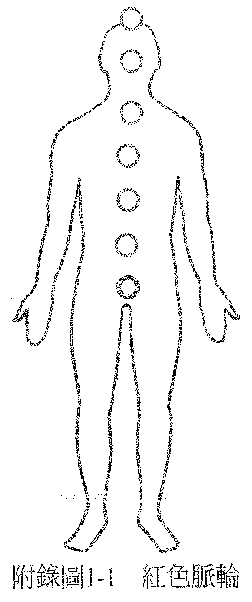
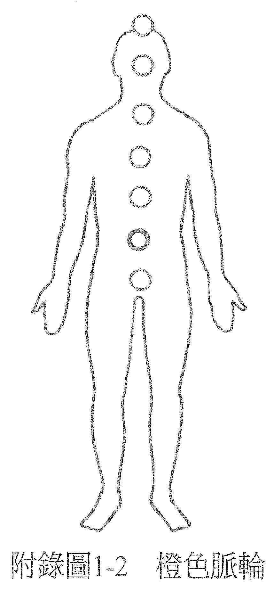
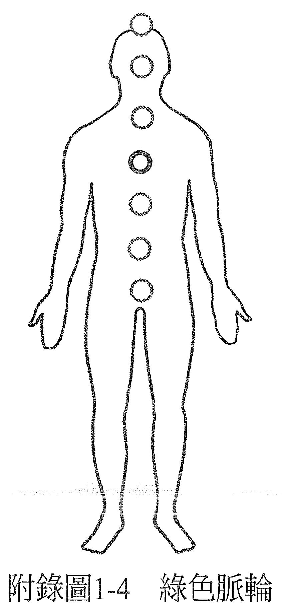

# 附录 1——脉轮疗愈指引

## 红色脉轮

又称为：海底轮、安全中心、慕拉达惹（Muladhara）。

位置：会阴，位于肛门和性器官之间。

身体部位：与这个脉轮有关的身体部位包括：淋巴系统及骨骼系统（牙齿和骨头），男性的前列腺，荐神经丛，以及体内由荐神经丛掌管的部位及功能，包含膀胱、排泄系统，以及下半身的末梢（腿和脚的各部位，如脚掌、脚踝等）。注意：当我们说一个脉轮和一个系统有关时，意思是当有一个影响发生在整个身体系统，便可追溯到和这个脉轮有关的紧张。比方说，有症状出现在整个骨骼系统，例如全身性关节炎，其原因就可以追溯到红色脉轮里的紧张；但手臂骨折的话，因为是身体特定部位的骨骼而非全身性的问题，那就要追溯到管理身体这个部位（也就是手臂）的脉轮——蓝色脉轮。

在内分泌系统中，红色脉轮又与肾上腺有关。虽然理论上，肾上腺的分泌和红色还有黄色脉轮有关，但因为是在生存受到威胁的时候才会刺激肾上腺素的分泌，所以它主要还是和红色脉轮有关。

感官：与此一脉轮有关的感官是嗅觉，它是和生存有关的基本感官。所以，嗅觉相关的器官——也就是鼻子，和红色脉轮有关。

意识：和红色脉轮有关的意识是安全感、生存、信任，也就是安全、安心的感觉。对多数人来说，人生当中与安全感有关的部分，和他们与金钱、家园、工作的关系有关。是否能够安然自在，以及临在于当下，也和这个脉轮有关。

自然元素：和红色脉轮有关的自然元素是「地」，也因此，红色脉轮显示的事情之一，就是我们与大地的关系，或是我们对于生活在地球上的感觉。

红色脉轮也反映了我们和母亲的关系。传统的家庭结构中，是母亲为孩子提供营养及安全的环境。由母亲喂乳的小孩会认定一些想法（「这就是丰盛」或「我得到的永远不够」，或「你必须奋力争取你想要的」等）。宝宝和母亲的关系会奠定这个人与所有代表安全感的事物（如安全保障的家园、工作、金钱）之间的模式。

当我们感觉和母亲疏离，觉得她不爱自己或没有提供养分，这个感觉就会切断与自己根部的连结，在海底轮或说红色脉轮处产生障碍。我们对自己这部分意识的感觉，会受到一个由缺乏安全感或恐惧所染色的过滤器影响；除非我们可以重新敞开心胸，允许自己受她爱的滋养。

没有根的人会有的其他症状，可能是没有自己的家，觉得很不自在、不踏实，无法用自己在物质世界的个人经历产生出属于自己的观点，或是很难好好活在当下。

当一个人在这一刻透过红色脉轮来看世界，他会受到安全感、生存、想要有保障、或满足物质需求所驱策。他也可能会想为内在灵魂寻求营养，但这里不是指食物，而是一种精神上的滋养，能给与身体内的那个你一种稳固和满足感。

当人生某段时期中主要的驱策力是安全感或生存，这段时期的根据地就是红色脉轮；我们会按照当下的想法或感受，把意识由红色脉轮出发再移动到其他的脉轮（「主要驱策力」的定义就是：所有决定产生的根源，以及驱动个人的力量）。

当红色脉轮很澄净，你会感到安全、自在、稳固且踏实，能够临在于身体，用心活在身处的当下，在物质世界里生活得很好。而且能够信任自己的观感，整体而言，没有信任感方面的问题。

在情绪上，当红色脉轮有紧张，会是一种缺乏安全感的感觉，再多一点紧张的话便会感到恐惧。若恐惧更多了，就会觉得生存受到威胁。一旦这种紧张感持续一段时间，或是变得极度强烈，身体的一个部位或是体内与红色脉轮有关或受其掌管的功能，就会产生症状。

所以说，任何影响到和红色脉轮有关的身体部位或体内功能的失衡状况及症状，都是反映了这个人红色脉轮的意识里，与安全感、生存、信任有关的状况，得到滋养的意愿或能力为何，或是和母亲的关系。

这里必须强调一下，母亲的行为或待人处事的方式与这个人的症状是没有直接关系的，有关的是此人选择如何回应人生中这些令他倍感压力和紧张的情况。例如，同一个家庭中的两个孩子，可能遭遇相同的外在情况，却做出不同的回应，结果其中一个出现了症状，另一个却没有。

所以不是说某些情况会导致哪些特定的症状，而是在看到是什么症状以后，可以了解这个人经历过什么让他倍感压力的情况。如果身体某半边有红色脉轮方面的问题，那我们也可以从意志面和情绪面，或男性面与女性面的二元法来检视（前面提过，天生右撇子的意志面是右半边；天生左撇子的意志面则是左半边）。

因此，当代表意志面的那只腿产生问题了，可用其症状产生的影响来解析问题所在。若某人需要支撑（例如用拐杖或棍子），这等于是此人的意识一直以来的情况：他很需要支持、也在寻求支持，才能够做出决定；他不信任自己的意志。虽然他决定要去做一件事，可是在得到别人足够的支持、有别人肯定他所做的决定是正确的以前，都不会采取行动。

如果受影响或有障碍的腿是男性面的腿，可能代表无法信任（属红色脉轮的一部分）男性；如果是一位男性的腿受影响，那这个症状显示出他不信任身为男人的自己。

如果受影响的是代表情绪面的那只腿，表示他在情绪的最深处感到紧张，或是对某人有情感上的依赖。这个部分之所以受到影响，是因为决定想要抓住某个人，却没有想到什么才对自己最好。或者，可能在红色脉轮的金钱、家园或工作的问题上，经历过情绪冲击。

如果受影响或有障碍的腿是女性面的腿，可能代表无法信任女性；如果是一位女性的女性腿受影响，则可以说这个症状显示出她不信任身为女人的自己。

我们也可以从这个人需要什么才能回归平衡的角度，来解读他的症状。举个例子，如果这个人的腿不能弯曲，而这影响了他的行动力，那我们可以说，他若要痊愈，就需要让行动变得更有弹性且自由。

如果肾有问题，那么虽然肾位于太阳神经丛的高度，但我们会考虑的是它和排泄系统有关。肾所在的高度与力量或自由的认知（黄色脉轮）有关，和我们认为与信任（红色脉轮）有关的层次结合的话，这方面的症状便可以解读为对力量缺乏安全感（认为自己缺乏力量，让自己看起来很无助），或是对自由缺乏安全感（认为自己缺少自由，感到受限）。

解读肾的症状时，也可以想一想它的功能。肾有分解血液里的毒素、排毒的功能。而血液代表心，或是爱的感觉，毒素代表妨碍人感受爱的心态。这些毒素已经累积到一种会威胁个人生存的强度了，需要做出改变。这个人需要允许身边的爱滋养他们，放下那些会威胁到生存的心态。

我们认为对哺乳相关的化学物质过敏，例如牛奶或乳制品，或是对与大地有关的物产过敏，例如麦类制品，以及造成鼻子的过敏，像是花粉热等，都反映了红色脉轮的紧张，以及这个人和母亲关系之间的紧张，因为这些症状让他们有理由不去获得滋养。当这类心态改变了，症状也就会消失。

在这个世界上，一切都可以疗愈。

## 橙色脉轮

又称为：脾轮、丹田、知觉中心、斯伐迪斯他那（Svadhistana）。

位置：腹腔的中心。

身体部位：和此脉轮有关的身体部位包括生殖系统、性器官、腰椎神经丛，以及体内由腰椎神经丛掌管的部位及其功能，还有腹腔里的一切；相关的腺体则是生殖腺（睾丸和卵巢）。

感官：和此一脉轮有关的身体感官是味觉（品尝）及胃口，因此可以说，身为味觉器官的舌头与橙色脉轮有关。橙色脉轮也和触觉（和「尝」有关的部分）相关。

意识：橙色脉轮关乎与食物、性有关的意识，以及生育。当身体里由此脉轮掌管的部位感到紧张，表示相关的意识（也就是和食物或性、生育有关的执着或贪婪，或者以上全部）在紧张。也可能反映了此人在人生中这个症状出现的当时，所压抑的情绪。

自然元素：与橙色脉轮有关的自然元素是「水」。所以，橙色脉轮反映的是人和水的关系。如果一个人和水的关系不和（例如对游泳或乘船有困难），那么这个不和谐，也反映了他和意识中所代表的水（食物和性）之间的关系。

当症状导致此人无法生育，我们会说这始于一个不想拥有小孩的决定。因为一切都始于意识，身体只是执行了意识所做的决定。既然相信没有治不好的病，那在承认旧有的决定之后，就有机会加以逆转了，在内心深处做新的决定，然后看着身体执行这些新的决定。

橙色脉轮代表身体以及驻于体内的意识，两者间的沟通。身体会说出它想要及需要什么。它会透过胃口来表达需求，所以例如身体在物质层面上需要钾，那它就会对香蕉或其他含钾的食物产生想吃的欲望（即胃口），胃口大小也会如实显现出身体所需要的量。内在存有可以按身体的意思满足它所传达的需求。

身体是意识的载具，一如车子是为里面的驾驶而存在的一样。如果车子透过工具告诉你：它需要汽油了，那么供应它所需的，而不是自认它需要其他东西，才是明智之举。

在社会里的我们，学会了不相信自己的胃口，反而愈来愈依赖专家告诉我们该吃什么。然而，专家各有各的意见，而且不同的活动会引发个人不同的需求。例如，当秘书的人需要的营养，和挖煤矿的人需要的就不一样。要与橙色脉轮保持良好的关系，就要让身体与意识之间有良好的沟通，了解身体需要什么，并听从这样的沟通。

橙色脉轮也和愉悦有关。也就是说，就食物和性而言，我们会受令我们愉悦的事物吸引。不过，一定要记得让身体与意识沟通。比方说，我们可能会想吃一些虽然会让自己感觉愉悦、但身体却不怎么喜欢的食物。吃完将近一千公克的巧克力冰淇淋之后，对感官的留恋可能会告诉我们再多吃点，不过同时，身体会告诉我们已经够了。如果再多吃，就会不舒服而不是愉悦。

我们必须倾听身体，知道什么让身体感觉良好。如果顺从口腹之欲后，导致身体的不适，那它就不再满足为物质载具提供燃料的主要目的，我们就必须放下执着，重新建立更清楚的沟通，最后让对食物的欲望重新好好运作，与身体真正想要的一致。

我们也要知道，胃口一定会发挥它该有的功能，身体因为某些饮食习惯而产生的不适，只是显示意识和能量系统有哪些部分失衡了而已。例如，我们可以问自己：身上不适之处是哪一个脉轮所在地，把它视为意识里尚未澄净之处。总之，疼痛或不适都是一种讯号，表示有地方失衡且需要改变了，如此才能重回天生和谐的状态。

身体只会对某些事物产生性的反应，就像人的胃口只会对某些特定食物有反应一样。如果倾听身体，它就会告诉你：什么是能让你愉悦的，而且与外在强加的道德观或他人认为对错的想法无关。这里关心的问题只在于什么对我们好、什么对我们不好。

如果有症状出现在性功能，就表示有一些我们一直在做的事，或是一直怀有的心态，对我们而言是不好的，需要改变。

在身镜系统中，我们把爱与性加以区别。它们隶属能量系统里不同的部分，然后由我们决定是否要结合两者，以及要如何结合。橙色脉轮代表的是我们和「偷悦」（从自己身体得到）的关系。因此，它的重点是纯粹的知觉、有什么感觉，而不是我们认为它「应该」要有什么感觉。

当橙色脉轮有一边出现症状，可以去看看它代表了意识有什么样的紧张，从身体会与意识沟通的角度去思考这个情况。例如意志卵巢有状况（意志面那一边的卵巢）的话，代表的是这名女性在性方面有些紧张（卵巢掌管性），身体想要的和她意志想要的不同，因而产生了冲突（紧张就是因为有冲突、不合）。身体说：「我要那样」，但她的意志说：「我不要你那样。」

如果紧张是出现在情绪面的那一边，那就是身体想要的和情绪想要的之间有了冲突。这里要特别强调，问题不在于要允许自己做什么或不做什么，而是我们允许自己去感受什么，并承认自己真实的感受。

当人生主要的动力是感官享乐，也就是身体上的愉悦，可以说在人生的这段时期里，橙是色脉轮是我们的根据地。我们在当下选择将注意力放在哪里，意识就会由此脉轮出发移动到其他的脉轮。

虽然橙色脉轮与我们和食物、性的关系有关，但有一些和食物及性相关的症状却与这个脉轮的关联性不大。例如，暴食症是一种饮食失调，虽然很有胃口，却没办法从吃下去的食物那里得到营养，听来导致这个问题的是红色脉轮，因为它和一个人是否想得到养分（滋养）的意愿有关。而同样是营养的问题，黄色脉轮是透过呕吐来拒绝，黄色脉轮会紧张，可能又是因为对「自由」过于敏感的原故。

一个红色脉轮能量严重卡住的人，可能性方面会很不顺，但橙色脉轮却没有任何问题。例如，虽然卵巢是由橙色脉轮所掌管，但阴唇却是由红色脉轮管理的。男性也有类似的例子，其摄护腺由红色脉轮掌管，而睾丸——也就是性的动力，则是由橙色脉轮掌控。

觉得很缺乏安全感的人可能在性方面不会很顺利，可是等红色脉轮疗愈了之后，这现象就会获得改善。因为这个原故，所以有些体系会误把红色脉轮视为性的脉轮。然而医学的神经图显示生殖腺是由腰椎神经丛所掌管，与橙色脉轮有关，而不是由与红色脉轮有关的荐神经丛所掌管。

虽然绿色脉轮（也就是心轮）与触觉带来的连结感有关，但与触觉带来的感官享受有关的却是橙色脉轮，此外它也与身体和情绪层面上的感觉有关，因为这些感觉都是身体与体内的意识之间的交流。橙色脉轮主要就是和我们觉得什么令人愉悦、什么令人不悦有关。它的重点是我们在身体上感受到的愉悦。

就能量体而言，橙色脉轮与情绪体、还有是否愿意感受自己的情绪有关。虽然我们感受到什么样的情绪还会牵涉其他的脉轮，并受其影响，不过这里讲的是整体上是否允许自己去感受。例如，我们在听音乐的时候可以很机械化，也可以让自己很受音乐感染，去感受它。这个要去感受的决定，整体而言就与橙色脉轮有关，但感受到了什么则和音乐的内容以及演奏的音调有关。

若我们曾有引起极度强烈情绪的经历，而这些情绪很难去面对，例如一种遭亲近且信任的人背叛之感，或许会受创甚深，在内心深处决定不去感受这令人痛苦的关卡。一位女性曾和前女婿之间有过非常棘手的情绪状况，后来她有了性冷感，在与先生的性生活上，不让自己感受身体的讯息。她关掉了所有橙色脉轮的一切。

因此，当一个人有一些症状显示出橙色脉轮里有紧张，而且是位于橙色脉轮所代表的意识区块，那可以看看，这些要素之间有着什么样的关联。比方说，可以看看我们与食物、性、情绪之间的关系，整体而言有何相似之处。

或许你会发现这些关系全都互相反映出彼此，或是其中一个被放大了，另一个却受到了忽略。例如，如果性不够满足，食欲可能会增加，表示这个人选择用另一种方式来满足橙色脉轮的欲望。如果吃进的食物比橙色脉轮所需要的多更多，那这个脉轮可能会自己关闭，结果性欲就受到了影响。

用这种方式来看自己的话，会知道需要做些什么就能重新感受到个人熟悉的平衡与健全。过度或不足的活动都可以重新得到平衡，我们可以决定去做该做的事，回归天生的和谐状态。

我们知道，这世上一切都可以疗愈！

## 黄色脉轮

又称为：太阳神经丛脉轮、力量（权力）中心、玛尼普惹（Manipura）。

位置：太阳神经丛。

身体部位：与此脉轮有关的身体部位包括肌肉系统、全身皮肤、太阳神经丛、大肠、胃、肝，以及其他位在太阳神经丛区域里的器官与腺体。在内分泌系统里，与它有关的腺体是胰腺。

感官：与此一脉轮有关的身体感官是视觉。因此，视觉的器官――眼睛，也和黄色脉轮有关。

意识：与此一脉轮有关的意识内容，包括和力量（权力）、控制、自由、能自在地做自安适地存在等相关的感受。心智活动也和这个脉轮有关。

因为黄色脉轮和视觉有关，所以可以说，所有视觉受损的人，意识里和上述内容有关的部分或多或少都有些紧张。

视觉的情况其实反映了我们的存在方式。近视眼的人比较容易看到离自己较近的事物，看不见较还的事物。他们注意力的方向是向内的，或是远离外在的。他们对这个令人畏惧的世界的反应，就是退缩到内在，透过不安全感或恐惧的视觉滤镜来看世界。不只黄色脉轮紧张，红色脉轮也是。

而远视的人则看到较远的事物，看不到身边的事物。他们注意力的方向是远离内在的，往外延伸，略过外在。他们回应对世界恐惧的方式，就是略过它，透过愤怒或罪恶的视觉滤镜来看世界。不只黄色脉轮紧张，蓝色脉轮也是。

有散光（乱视）的人对自己的欲望或感受，有扭曲的观感，至于是什么样的扭曲，就要看是意志眼还是心灵眼（情绪眼）受影响而定。他们认为自己真心想要的或感受到的并不恰当，会自己认定要有什么感觉才对，并且深信不疑，不相信自己真实的感受。他们的视野显示观感受到扭曲。除了黄色脉轮以外的脉轮也会受到影响，至于是哪些脉轮受影响，则要视是哪些认知受到扭曲而定。从症状全是由自身创造的概念来看，「看不见」可说是不愿意看到某个事物。因此，任何一种影响视线的症状，都从不愿意看到某个事物开始，或是不想去看生命中某个令人不快乐的问题。如果愿意去看它，看看自己对这件事的感受，就会决心针对它做点什么了。

色盲显示了一个人与诸脉轮之间的关系。例如，无法分辨红色、绿色，表示这个人无法分辨安全感与爱之间的差别，因为它们分别属红色脉论与绿色脉轮的一部分。厘清这点之后，就会重新对颜色有适当的视觉反应。

内分泌系统中，当胰脏受到影响（如糖尿病），身体系统便无法接受糖分。从症状都是由自身创造的概念来看，是他们让自己得不到甜蜜的感觉。当一个人离甜蜜的感觉很近时，他会觉得「做自己」的这个权力受到了威胁，情绪跟着出现，目的是要创造出安全的距离，而这个情绪就是愤怒。因此糖尿病与压抑愤怒有关，会出现在当一个人在人生中对某件事很愤怒、却又无法自由表达的时候。若症状是胰脏位于黄色脉轮的情绪面，可视为这个人在「自己的情绪」和「安适地存在」之间，感到紧张或冲突，而生病是他的一种情绪反应。假如是在意志面，就可视为和意志之间的冲突。

虽然一般把糖尿病视为遗传性疾病，但我们也可以把任何一种疾病都视为与某一种存在之道有关。如果在一个家庭里，父母有一种特定的存在方式导致自己产生某种症状，而小孩模仿了这个存在方式，那就可能会在自己身上也创造出同样的症状。当改变了这种存在之道，症状就解除了。

可以把糖尿病视为拒绝甜蜜，但血糖过低的情况则又刚好相反。这个人用假装柔弱和无助的样子，来企求甜蜜，或是借以得到他人的爱。与此脉轮相关的其他器官（肝、胆、脾）之症状，也都和无法好好处理愤怒有关。

自然元素：与黄色脉轮有关的自然元素是「火」，因此可从我们与火或太阳的关系，看出我们与此脉轮代表的意识内容之间的关系。一个对阳光敏感的人，可以说他对力量（权力）、控制或自由特别敏感。如果晒了过多太阳，皮肤产生问题，那可解读为他给太阳神经丛脉轮过多的能量或注意力。

当一个人生活中主要的驱动力是自由或力量时，表示黄色脉轮就是他这一段人生当中的根据地。

黄色脉轮也与心智体、心智活动有关。心智活动过多的人，会觉得黄色脉轮有紧张。

心智是意识的一个工具，但它也只不过是意识的一部分，显然，人还有其他的部分，例如灵魂和心灵。

小孩来到世界上时，是灵魂透过一份个体化的意识化身为人，也就是心灵。小孩也有一个心智，与黄色脉轮有关，他用心智来学习。他学到当他对声音（他的名字）回应，做出特定的举止，就会得到爱。他很快就开始透过他所认知的事物，而不是他本来的样子来辨识自己，发展出所谓的人格模式——这也存在于黄色脉轮。因此，人格模式就是他对于自己心智的认同，西方社会把这种存在的状态叫做「社会常规」，也就是一般定义的「正常」。

有时候人格模式会和心灵一致，有时却好似往其他方向拉扯，变得紧张，除非两者回归和谐关系。内在存有或较高自我、心灵，可能有某种渴望，但人格模式却因为活在社会的规范下，所以很难加以实现。有的规范很宝贵，能保护社会，但有的只会让人无法做自己，活出真实的自我，因此产生的紧张最后可能就导致一些症状，除非我们重新做回真正的自己，活出这个自己，选择不再受到画地自限的观念影响。我们可以选择活在一个这样的社会：重视让人快乐、让人感觉自然的生活之道。

因为对心智活动有相当强的认同，所以西方社会有许多人都很难允许头脑休息，尽管他们想要感受内在的平静。头脑不再只是工具，它已变成了主人。

要找回对头脑的主控权，就要有意识地决定要接受或拒绝哪些想法，主动选择观点，而不是被动地受别人的观点影响，并允许头脑在需要它做分析之前，都能无为地休息。如此一来，会逐渐增加活在当下的能力，看见事物真实的样貌，而不是透过一个认知的过滤器，用自己的想法来过滤才是事实。意识也会更加祥和、安静，更有能力和自己其他的意识层次交流,而不会用一些观念或理由来否定直觉，不听后它。

当人格模式和心灵的方向不同，这时候我们经常把它称为小我。虽然很多灵性的训练都以摧毁或制服小我为目标，但也可以把这种方法视为是在对抗自己的一部分，借由分别自己的一部分来制造额外的紧张，结果只是让自己更难从小我跳脱出来。

更有意义的做法是接纳自己的每一个部分，并有意识的选择要让自己符合内心深处的真实，让人格模式和心灵一致，这样就能在无须削减或摧毁自己任何一部分的情况下，让恐惧消失。

要做到这样，其一是要知道，人生中发生过的事情，都是因为我们真的想要它发生，都反映了内心深处做过的决定。承认这点后，就能发觉圣灵一直在引导我们，就能放下与过去有关的紧张，让自己活在当下，重新对未来有更正面的方向感。

我们也可以知道，某种程度上，我们一直都做得很对——虽然不见得清楚自己的行动背后有什么好理由。但这些行动就是和我们的价值观、感应力是一致的，而它们就是我们的优先选择以及所有决定的基准。

西藏秘传哲学也这么说，当我们了解自己真实的样子、一直以来的样子、以后永还会是的样子，我们就会知道永远不用为自己的行为道歉或找理由。从这个角度来看，每个人一直都在受心灵指引，并按照自身信奉的价值观，一直在做对的事。

当然，我们也可以选择承认有一些存在之道已经行不通了，不管我们为它们找了哪些合理的借口，然后我们会认清自己不再需要用这种方法。当你能承认可以有其他更有意义的选择，并据此建立不同的价值观，就会对自己产生不同的感受。这样，我们就能允许另一种对自己比较有良效的存在之道出现在意识里，心中有更多平静。

我们无须继续认同一个某人曾做过的，但已不复存在的行动，或是为它辩护。反而可以用慈悲看待这个人，然后继续好好地过自己剩下的新人生，从加诸自身的痛苦中解脱，就在当下由另一个感觉更好的生命经验中重生，感受更多快乐。接着，也就能感受意识可以自由探索更深层、更进化的生命境界。

如果在做疗愈的时候，案主感到恶心，表示虽然这个人的内心深处希望得到疗愈，也做了疗愈，但在人格模式的层次上，仍然有一些执着，与太阳神经丛的紧张有关。重新肯定内心想要痊愈的决定，以及必然随痊愈而来的意识改变，会让这个过程轻松很多、变得温和许多。

这也表示要让人格模式、小我，和意识深处、也就是心灵层次所做的决定，两者变得一致，让整个存有与其各个部分均变得一致，拥有共同的意念。当人格模式有机会去同意心灵的决定，它知道其决定真正反映了整个存有真心想要的，也反映了存有认为什么对它是好的，人格模式的意念就会与心灵、灵魂的意念一致，产生一种与之协同的新感觉。

简言之，就是去做你内心深处真心想做的，别去做那不想做的。无论何时，就是做真正的你，信任你的旅程。如果你忘了这条人生的基本原则，失去平衡了，那就让自己先找回安心，去回想你内心的真理，也就是：你在这里是为了要快乐，而且真的，一切都可以疗愈！

## 绿色脉轮

又称为：心轮、朝气蓬勃的爱的中心、阿那哈它（Anahata）。

位置：胸腔中心点。

身体部位：与此脉轮有关的身体部位包括心脏、循环系统、心脏神经丛，还有肺及整个胸腔。

感官：与此一脉轮有关的身体感官是触觉。虽然从知觉的层面来说，触觉也与橙色脉轮有关，不过就绿色脉轮而言，是和我们对于「被触碰」这件事有什么感觉，以及和透过接触而与身体内的意识连结有关。注意：我们认为对别人的碰触很敏感的人，原因就和绿色脉轮有关。同理，喜欢在说话时和别人有肢体接触的人，在说话时是从绿色脉轮来连结的。觉得身体某部位或皮肤不敏感、麻木的人，是在逃避感觉，但这和橙色脉轮比较有关，因为橙色脉轮是去感受的意愿还有情绪。

当一个人在接受按摩的时候，可以纯粹是身体的经验，按摩师把他当成一块肉，摆来弄去；但按摩师也可以很敏锐地去感受这个身体之内的个体，以及对方接受这样的触碰时经验到了什么，并按照他连结体内意识的感觉，调整使用的手法。当这种连结感存在，这种触觉就与心轮有关。

意识：前面几个脉轮都和自己内在的、或关于「自己」的经验与感受相关，但从绿色脉轮开始，就与周遭环境连结。关键字就是「连结」。

绿色脉轮与连结、人际关系，还有对爱的认知有关。人际关系包括伴侣关系，或是和任何我们有感情的人连结，例如父母、小孩或手足。当它与爱或被爱的感觉有关，可能会觉得像是一种付出爱与接受爱的过程，但也可能感觉像是在共享一个感受到爱的空间，爱非常流动，感觉受到接纳，而不见得是施与受的感觉。

自然元素：与绿色脉轮有关的自然元素是「空气」，我们和空气的关系反映了我们与爱的关系。对空气、呼吸有问题的人，例如气喘、肺气肿，「无法」吸气或吐气表示他们决定不让爱进来或出去。

与线色脉轮有关的胸腺掌管免疫系统，所以免疫系统受感染的人（爱滋或肌阳性）都有一种状态，在影响他们对爱的认知。他们认为自己的生活方式令所爱的人疏远，例如：他们或许有不同的性倾向，或是使用社会不接受的药物。这种疏离也可能是因为活在一个很压抑的社会，像是海地在杜瓦利埃（Duvalier）统治的那段时间里，出现了爱滋这种病，使得当时家人之间无法互相信任。不过，导致爱滋病发持续不断的要素，还是在于这个人对爱与被爱的感觉。

心脏或循环的问题，或是任何影响整个血液循环系统的症状，都可以追溯到绿色脉轮的紧张，还有这个人对爱的认知，以及爱是否流动。

其他发生在绿色脉轮处的胸腔或背部的症状，都表示绿色脉轮有紧张。乳癌或其他绿色脉轮处的肿瘤或皮肤有问题，也显示它有紧张。

癌症象征有一些东西受到压抑或没有表达，至于是什么东西，可从身体受影响的部位去看。当女性的乳房出现症状，是和她当女人或母亲的感觉有关。

若按照合理推论，得了乳癌表示乳房可能会被切除。从这个情况是生病的女性自己创造出来的概念看来，可以说，是她切断了和自己女性面的连结，她平常表现出较多的阳刚特质，超过她自然的平衡状态。这样她会有硬块的理由也就很明显了。她需要从胸腔移走一些东西：长年在绿色脉轮处（代表连结与关系之处）压抑的愤恨。过去发生过一些让她感觉很糟的事，她决心不想再活在那样的情况里。

如果症状出现在绿色脉轮的感受面或情绪面，就是这人和其他人产生了冲突，导致他有

