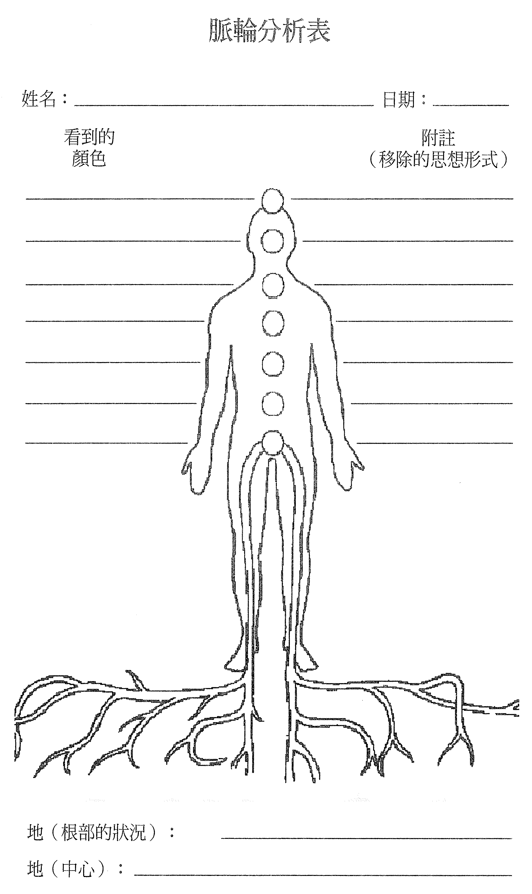

# 附录 5——脉轮分析表及能量疗愈分析报告

有些能量治疗师觉得记录他们参与过的疗愈内容是一件有趣的事，他们会整理出相似之处。也就是整理出：当脉轮里有哪些状况时，会反映出哪些症状。

这里用的「脉轮分析表」及「能量疗愈分析报告」是给大家使用的一个范例。可从书本上影印下来（或许在一张纸上影印成正反两面），直接填用，或是发展出自己的版本，也许还更符合自己的需求或兴趣。

做能量疗愈的时候，你一边检视案主的能量系统，一边在脉轮分析表上记下你看到了什么，例如：在哪些脉轮里看到哪些颜色，你看到并移除了哪些思想形式，在根部看到哪些情况。

有时候疗愈没有一次做完，那你可以比较案主在后续的治疗中，能量系统看起来有何不同，记下疗效的稳定度，以及案主接受改变的程度。

在能量疗愈分析报告上，则可记下案主的姓名和星座，症状名称及其内容（案主感觉到的症状情况），还有现场和（可能）后发的疗效。

就症状名称而言，你可以写下医学名词，像是「气喘」，至于这个症状的内容，可以写「呼吸困难」。虽然这是一个小且显而易见的例子，但遇到较不熟悉的症状名称时，你就会看到分开记录的好处了。

分开记录还有另一个好处是：可以从「是案主创造出这个症状」的概念，用不同的措词来记录症状对案主的影响（在前述的例子中，就是「让自己无法呼吸」）。

在疗愈立即发挥效果的情况下，你可以记下在疗愈完成时，所有明显的效果（例如：百分之八十的呼吸恢复了正常，胸痛消失了）。其他在做完疗愈的一段时间后才变得明显的效果，可以记录为疗愈的后发效果（例如：做完疗愈个案的一周后，呼吸完全恢复了正常）。

把有类似症状的人的能量系统拿来比较，也可能会很有趣，或是看看是否有什么星座特别容易有某些症状等。

之后，也许就能整理出无法轻易辨识内在肇因的症状，其患者彼此之间在能量系统上有什么关联。

脉轮分析表和能量疗愈分析报告是很棒的做法，可以创造出完整的纪录，也可以用于专业或学术研究上，来证明这世上真的没有治不好的病。

## 能量疗愈分析报告

姓名：__________

日期：__________

性别：__________

生日：__________

星座：__________

症状的影响：

\_\_\_\_\_\_\_\_\_\_\_\_\_\_\_\_\_\_\_\_\_\_\_\_\_\_\_\_\_\_\_\_\_\_\_\_\_\_\_\_

\_\_\_\_\_\_\_\_\_\_\_\_\_\_\_\_\_\_\_\_\_\_\_\_\_\_\_\_\_\_\_\_\_\_\_\_\_\_\_\_

\_\_\_\_\_\_\_\_\_\_\_\_\_\_\_\_\_\_\_\_\_\_\_\_\_\_\_\_\_\_\_\_\_\_\_\_\_\_\_\_

案主叙述的现场疗效：

\_\_\_\_\_\_\_\_\_\_\_\_\_\_\_\_\_\_\_\_\_\_\_\_\_\_\_\_\_\_\_\_\_\_\_\_\_\_\_\_

\_\_\_\_\_\_\_\_\_\_\_\_\_\_\_\_\_\_\_\_\_\_\_\_\_\_\_\_\_\_\_\_\_\_\_\_\_\_\_\_

\_\_\_\_\_\_\_\_\_\_\_\_\_\_\_\_\_\_\_\_\_\_\_\_\_\_\_\_\_\_\_\_\_\_\_\_\_\_\_\_

案主叙述的后发疗效：

\_\_\_\_\_\_\_\_\_\_\_\_\_\_\_\_\_\_\_\_\_\_\_\_\_\_\_\_\_\_\_\_\_\_\_\_\_\_\_\_

\_\_\_\_\_\_\_\_\_\_\_\_\_\_\_\_\_\_\_\_\_\_\_\_\_\_\_\_\_\_\_\_\_\_\_\_\_\_\_\_

\_\_\_\_\_\_\_\_\_\_\_\_\_\_\_\_\_\_\_\_\_\_\_\_\_\_\_\_\_\_\_\_\_\_\_\_\_\_\_\_

环境，附注，其他：

\_\_\_\_\_\_\_\_\_\_\_\_\_\_\_\_\_\_\_\_\_\_\_\_\_\_\_\_\_\_\_\_\_\_\_\_\_\_\_\_

\_\_\_\_\_\_\_\_\_\_\_\_\_\_\_\_\_\_\_\_\_\_\_\_\_\_\_\_\_\_\_\_\_\_\_\_\_\_\_\_

\_\_\_\_\_\_\_\_\_\_\_\_\_\_\_\_\_\_\_\_\_\_\_\_\_\_\_\_\_\_\_\_\_\_\_\_\_\_\_\_

签名：__________
