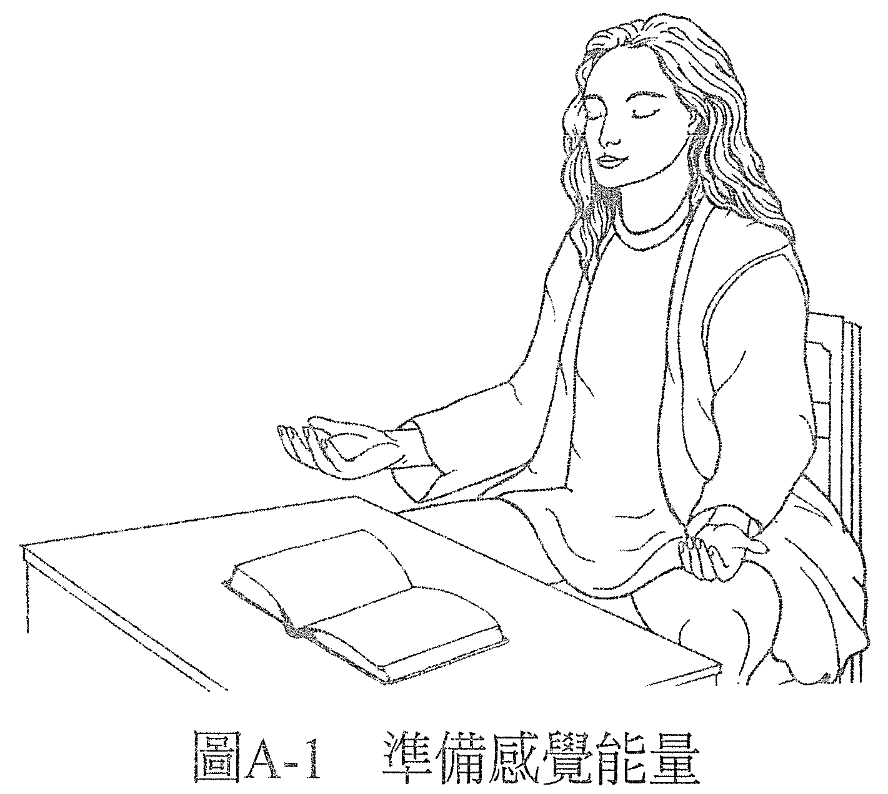
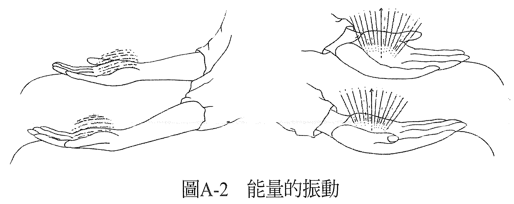
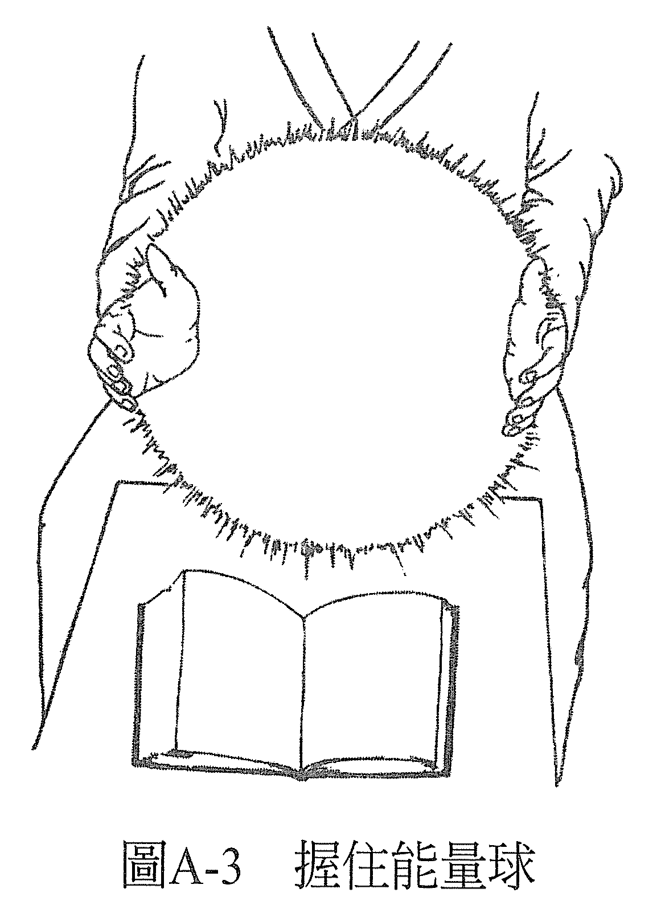
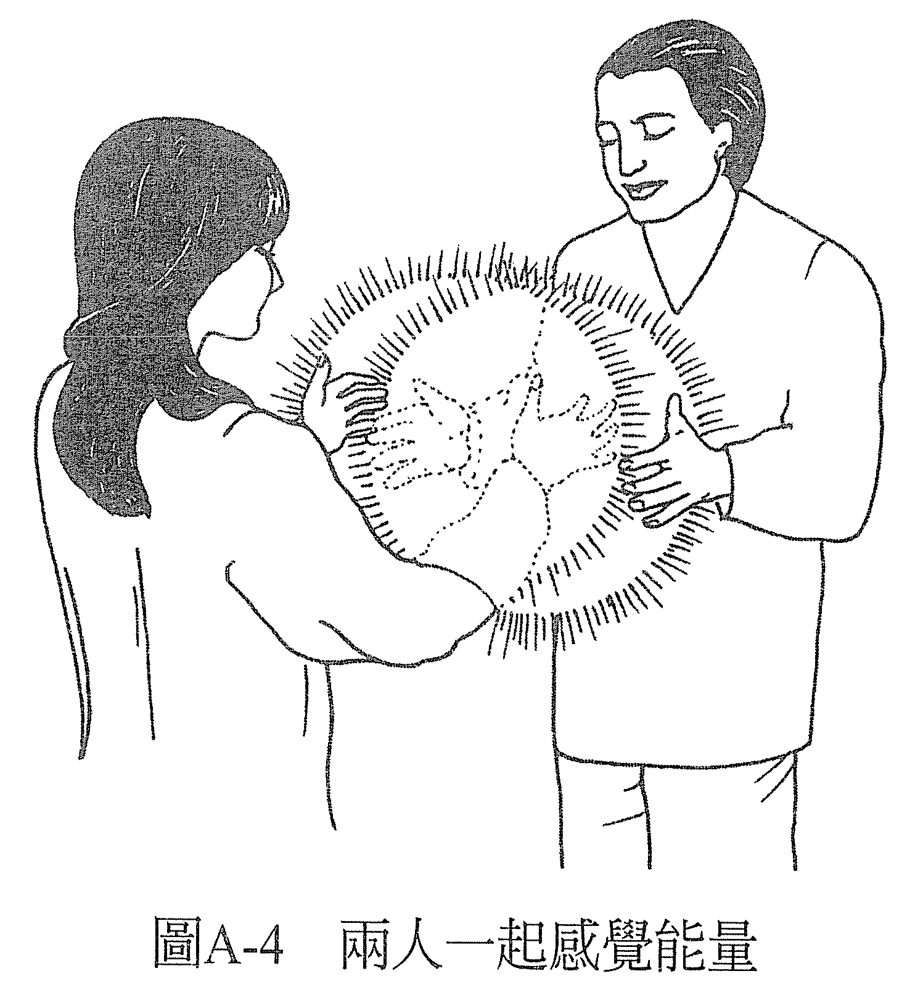

# 练习 A——基础能量练习：感觉能量

现在，把双手放在桌子或大腿上（后者尤佳），掌心朝上（见图 A-1）。注意掌心，以及两手掌心的皮肤表面，感觉那里的空气。你或许会察觉到空气的温度、空气的流动、或是空气的压力。花一点时间去感受，愈来愈清晰地感受它。

一边把注意力集中在此，一边去更感知与空气接触的皮肤。你很快就会发现到另一种知觉，也许是酥酥麻麻的，或是一种振动感，和平常的感觉不太一样。一开始可能很细微，可是你愈去注意它，就可以愈明确地感受它。

可以给这种知觉一个名字：「能量」。想象有一种叫做「能量」的东西流过你的双手，它通过双手流出的同时，也在牵引皮肤薄膜的振动（见图 A-2）。你可以想象这就是你此刻的感觉吗？想象你感觉到的是双手焕发着一团的能量。感觉到能量在手上发光。

现在，让双手保持敏锐，掌心对着掌心，双手之间保持大约四十五公分宽的距离。缓缓将手往彼此靠近、再分开，如此开开合合。留意双手靠拢时的感觉，与分开时有什么不同。

可以想象双手之间有一颗能量球，当你将双手靠拢，你会压缩这颗球，把更多的能量「揉」进去，让它更致密。就像在揉雪球一样，只不过揉的是能量球。你很快就会感觉到这颗能量球的轮廓及表面，你可以握住这颗球，并维持双手的敏锐度（见图 A-3）。

如果你是和别人一起做练习，那就两人面对面，各自握住自己的能量球，在可以感觉到对方能量的情况下，移动你的双手。例如，你可以把一只手放在搭档的双手之间，让这只手在对方的能量场里上下移动。一边移动，一边感觉双手经历到什么知觉。当然，你的搭档也可以同时这么做。花一点时间做这个练习（见图 A-4）。

做完之后，放松双手，看看你体验到了什么。有些人会用诸如「热」、「冷」，「电力」、「磁力」，「水流」、「一团稠密的东西」等词来形容这次的感觉。可以把这些词视为不同形式的能量，或能量的不同面向，就像灯泡的能量也有不同的面向一样，有些人会形容为「光」，有些人会说是「热」，也有的人说是「磁场」。这些都对，都是这股能量的不同面向。

不管你感受到什么，这个感觉都让你知道你正在感受能量。有些人可能会注意到，当他们在感受别人的能量时，感觉与自己的能量有些不同，不过他们仍然认为那是一种能量。

在做这个练习的时候，一些事情发生了。一开始的时候它只是个原始的感觉，一种没有名字的感觉。然后，我们称其为「能量」，我们用来描述这种感觉的语汇创造出了一种实相，假如我们用的词不同，就会经验到不同的东西。

如果我们将这种感觉形容为「皮肤表面下的血流」，那么所经历到的就会是这种感觉。如果形容为「手没有知觉」，那对于形容的人来说就会是这样。因此我们说它是能量，就会经验到它是能量。

语言是很有创造力的。我们每个人都在创造自己的实相，用任何一种语汇来描述自己的经历，都是其中一种创造的方法。无论如何，我们一直都在经历到一些事物，一整天都在经历，而我们会用一种特定的方式告诉自己正在经历的是什么。虽然我们所经历到的可能给人的观感有无数多种，但我们却选择用某种特定的语汇来去形容，用特定的语汇来强化这个观点。我们选择了那就是我们的实相。

当你知道了这点就可以意识到，你平日在使用什么样的语汇，以及你是透过这些语汇创以造出什么样的实相。

**你用什么样的语汇来形容自己的经历，就会创造出什么样子的实相。**

刚才你在做练习的时候，就已经从一个实相走到了另一个实相：从没有感觉到能量的实相，到了一个能感觉到能量的实相。在这个新的实相里，你可以从能量的角度来描述你所经验到的。

我们用了三个步骤来做这个转换：

1. 决定在新的实相里，什么是真实的。我们决定了在这个新的实相里，什么是真实的。我们决定了你的双手会感觉到一些东西。
2. 增强此刻正在发生的感知。虽然第一步来自本书的引导，但第二步开始就得来自于你。是你让这些语汇有了意义。或许你曾对自己说：「我现在好像有一些感觉了。也许这就是这本书所说的。没错，这感觉愈来愈强烈了。」你助长了这个此刻正在发生的感知，给自己理由去相信这个过程。
3. 决定现在它是真的存在。最后，你可以决定：「现在，它真的存在。现在，我感觉到能量了。现在，我可以感觉到搭档的能量了。现在，我活在新的实相里。」

如果你和另一个人一起做练习，你或许会发现，虽然一开始它是个主观的经验，后来却有另一个存有也能在外在的物质世界里感觉到它，让它成为一个共同享有的经验——既客观又真实。

能量疗愈也是这样。痊愈的感觉先始于能量治疗师的意识，是他主观的经验，然后外在物质世界里的其他人也感觉到了它。对这些人而言，它是有用的，它产生了效果。

当准备做疗愈时，每次开始的时候都将手放在同样的位置，也就是桌面或腿上，掌心朝上。接着，我们回想或是再次创造手里有能量的感觉。这样，就可以把手当成生物回馈（biofeedback）仪来使用，以知道自己是否进入了想要的意识状态。

「生物回馈仪」的概念是说，生物在不同的意识状态下，会改变其功能运作，呼吸的速度、流汗速度、血压、心跳等，都会改变。当仪器测量出的生物功能运作显示我们处于我们要的那个意识状态，仪器就会有反应，会有铃声响起、指针跳动或是闪光。

这台机器在说：「现在你处于你要的那个意识状态了。」等我们熟悉这种意识状态以后，就不再需要仪器通知。

平常用生物回馈仪的时候，我们找的可能是意识的阿法（alpha）或西塔（theta）状态。而在这个过程里，我们找的是有感受到能量的意识状态。既然我们是用能量做疗愈，所以它就会是一种能让疗愈发生的意识状态。

只要手中有这种知觉，你就能够成功做完一个疗愈。在疗愈的过程中，如果这种知觉停止了，你就必须停下来，重新建立起这种知觉，再继续疗愈。你随时可以创造这种知觉。

有时候，这种感觉可能会不请自来，但意义还是一样，它表示你处于能够担任能量治疗师的意识状态。或许不久后，就有人告诉你他的身体不舒服，你就知道这种知觉为什么出现了。它是为了疗愈这个人而出现的，如果他也愿意敞开心胸接受的话。你可以用能量治疗师的身分提供你的服务，让对方去决定他是否要和你一起参与疗愈的过程。如果他愿意，就去做！如果不愿意那也就算了！

也由于我们每次都得从这个姿势开始做疗愈，所以给它取一个特别的名字：「疗愈的起始姿势」。

——永远记得，在这个世界上，一切都可以疗愈——
