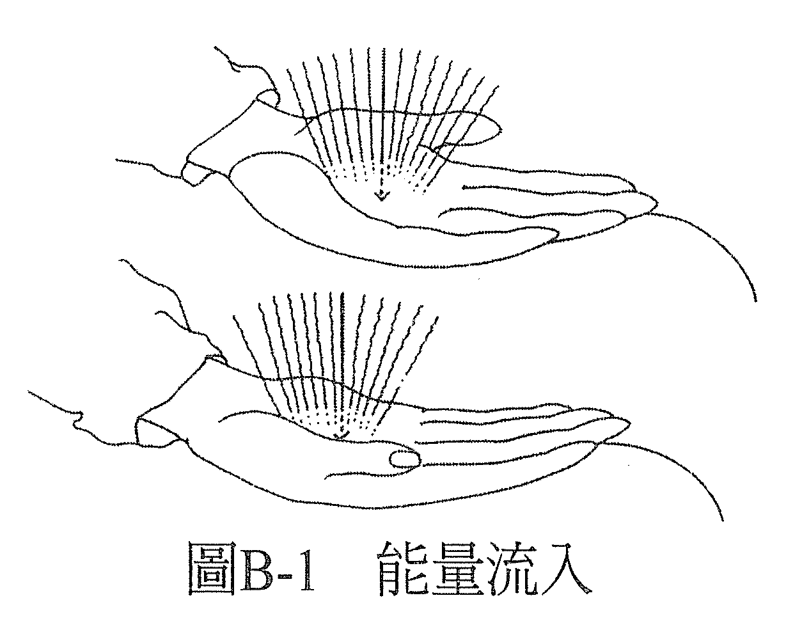
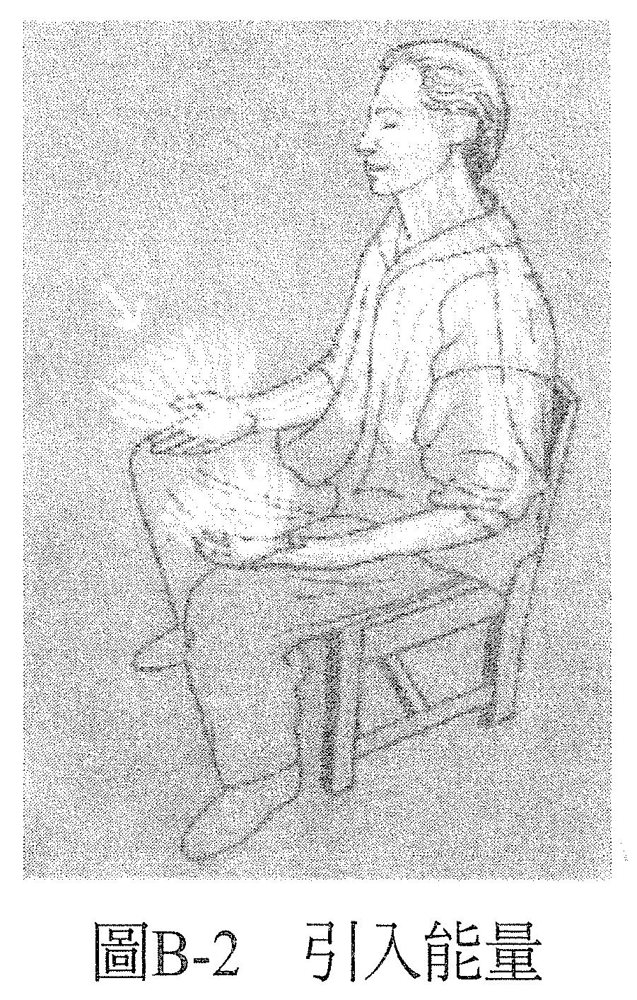
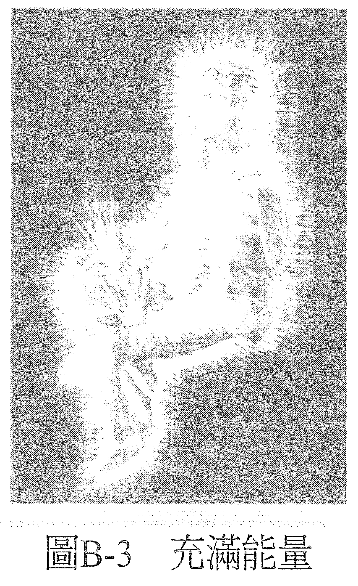
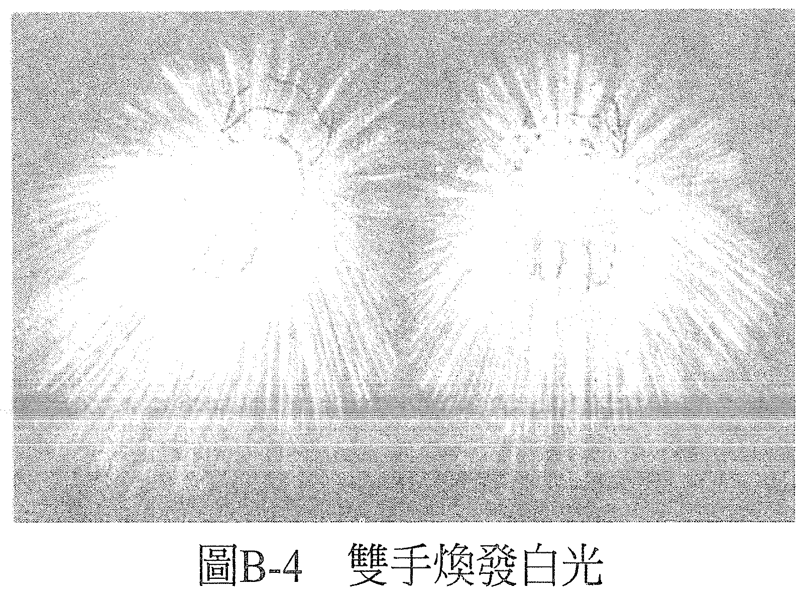

# 练习 B——引导能量

现在，专注在掌心皮肤表面的知觉，在你的手上再创造出感觉到能量的知觉。为了要能创造出这样的感觉，你要记住它。

这一次，我们要用不同的语言来描述这个经历。想象你所感觉到的，是能量从双手流进来，它在流进来的时候振动着皮肤。你可以想象你的手就像雷达接收器，对能量很敏锐，你周围的空间充满着能量。有无线电波、电视波、X光和伽玛（gamma）波、思想能量、性能量、光能、音能、热能、爱的能量、疗愈的能量……一大片浩瀚的能量之海——你可以感觉到这股能量流入你的双手（见图 B-1）。

感觉这股能量注入双手，顺手臂而上，进入身体（见图 B-2）。感觉这股能量在帮你充电。感觉自己的能量正在增加。感觉自己变得更干净、沉稳，尤有甚者是你想象当这股能量进入你的时候，你会感觉到的好的感觉。花一点时间在这之上，让这股能量充满你（见图 B-3），最后你感到自己全身上下都焕发着这股能量，你就像灯泡一样地发光。

现在，重新将注意力导向掌心与皮肤表面。这一次，我们又要用不同的方式来描述这个知觉。你要决定此刻你感受到的知觉，是双手焕发着能量。重新感觉能量在双手发光，就像做第一个练习时那样（见图 B-4）。

当你感到双手焕发着一团能量的时候，我们可以再给它取一个名字，叫它做「白光」。你可以想象你感受到的知觉，就是双手闪耀着白光，这样会比较容易想象那股光芒就是白光。我们用白光来做疗愈。花点时间去感受它，然后放松双手，继续下面的阅读。

当你决定这股能量正在流入双手，你可以感觉到它正在流入，并感受它的作用。而当你决定这股能量流出你的双手，就不只是你，别人也会有这样的感觉。你不用硬是要能量流出去，也不用硬是要把它吸进来。过程无须费力。你只要用练习A提到的那三个步骤，决定能量会朝什么方向流动，然后就是去感觉它正往那个方向流动：

1. **决定在新的实相里，什么是真实的。**
2. **增强此刻正在发生的感知。**
3. **决定现在它是真的存在。**

透过到目前为止的感觉，你会知道自己是能够感觉到能量的。你之所以知道，是因为你觉感觉到了。你也会知道自己不只可以侦测到能量，也能引导能量，因为你也做到了。这股能量一直在流过你，现在你也发觉你的意识可以引导这股能量。其实，你一直都在用意识引导这股能量。每个人都是由能量组成的生命，当我们以够强的强度阻碍这股能量流动，就会产生病症。

因此，所有的病症都可以说只是能量阻滞了而已。既然你有能力引导能量，你就有能力松开每个能量阻滞的地方，包括自己身上的以及别人身上的。然后，疗愈就发生了。当我们用这个角度来看事情，就会明显看到——没有治不好的病。你什么都能治好。毕竟，过去不也曾经有知名的能量治疗师这么说：他能做到的，你也一定能做到，甚至做得更好吗？难道你不相信他说得对吗？

————在这个世界上，一切都可以疗愈！————
