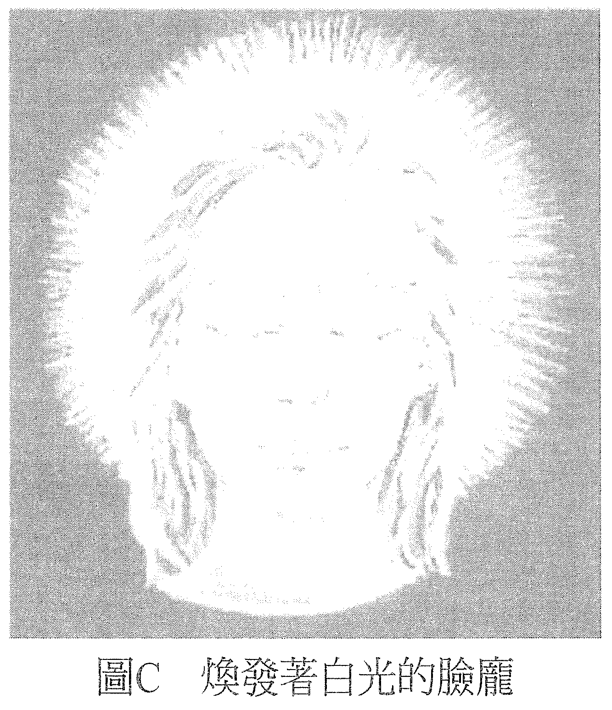

# 练习 C——看见能量／气场

做这个练习会让你的主观经验变得更加细腻，你会经验到不一样的视觉实相。记住，主观的感知在本质上原就是主观的，换言之，它们是发生在你自己的意识里，甚至还会觉得好像是你自己想象出来的。就算你有这种感觉，也用不着认为这种经验的主观性会让你的感觉无法成立。

我们以前在科学的世界里学到，有些事物是真的，有些是想象出来的。言下之意是想象出来的就不是真的。然而，我们也发现，在主观的感知领域里，纵使有些事物感觉起来是想象的，也并未灭损其真实性。当你进入不一样的视觉实相时，你会用到现在你已经熟悉的如下三个步骤：

1. 决定在新的实相里，什么是真实的。决定现在你会看到不一样的东西。
2. 助长此刻正在发生的感知。给自己一些理由去相信你的感觉显示它此刻正在发生。你正开始看到一些事情发生。
3. 决定现在它是真的存在。决定现在你正看到某样东西——就算感觉起来像是你想象出来的。向自己描述此刻正在视觉上经历到什么，它「看起来」像什么。

首先，将双手放在大腿上，两手靠得很近但不要碰到，重新创造出在练习B「引导能量」里经验到的感受。感觉双手焕发着能量，决定它们焕发着白光。现在就做，做完再继续阅读。

接着，你认定双手正焕发着白光，并看着置于腿上的它们，想象你看到它们正在发光。有些人看见有如炎夏的人行道上蒸腾的热气，有人看见它比较像是白色能量的光量，总之要认定你看到的会是你会认为与白光有关的东西，正从双手焕发而出。

现在就做吧！

如果觉得眼睛在玩弄你，没关系。此刻我们要的就只是一种视觉上的经验而已。不管你经验到什么，就算你认为那是一种视觉上的幻象，也是一种感觉；如果对方希望的话，你可以向他形容一下它们看起来像什么，或是画一幅画。这样就已经达到练习的目的了。

下一步可以是自己一个人看着一面镜子，或是面对你的搭档，看着站在你面前那张脸庞上的那双眼珠。如果你还不习惯看见能量，那不妨调整一下灯光让房间只有微亮，然后让案主的背景颜色变成单色，这样会比较容易些。

无论你看的是搭档还是自己的倒影，最好都不要只看眼睛的表面，而是要看进眼睛之后，或看入它的深处，看向那深处里的存有。你一边把主要的注意力放在这个深处，一边允许自己用广角视线稍微留意你所见的这张脸的周围，看起来像什么。

记住刚才你在手上看到能量的感觉，留意有没有类似的感觉。你可能会看到面前的脸庞改变了，也许变成其他的形状，或是变成其他的脸。对于每个看到能量的人，这都是一种自然且正常的现象，它也在揭露同样的灵性面向。不过，你暂时先把注意力就集中在你看见且认为是气场的光晕上。

有些人看见它是一团微光或是一道光，但也有些人看它是浅而淡的颜色。这些颜色会与脉轮的颜色有关，可以显示出这个人的意识此刻处于什么样态。比方说，如果散发出翠绿的光，就可以说他处于我们所谓的绿色脉轮的意识状态，以此类推（见图 C）。

现在就按照以上的说明，至少花一两分钟的时间做这个练习。如果你是和搭档一起做，那就在做完之后聊一下你们看见了什么。也许你会发现，如果都看到了颜色，那你们就能够看出当时所见的颜色与对方当时的意识状态有着什么关联。

假如你没有看到颜色，就向彼此形容一下你们看到的是什么。你们可以重复做个几次这个练习，每次都用不同的意识状态，看看视觉上会不会有不同的经历。举个例子，在做这个练习的时候，你可以想象你焕发着白光或是特定的颜色，或是感觉心轮充满能量，或在你生气的时候做，或在你分析思考一件事的时候做，看看视觉上会出现什么不同的经验。

多多练习，你就能轻松随意地创造出这样的感觉，把它当成另一种你可以运用的交流层面，它会让你看到周遭存有的意识正处于什么状态。当你知道它是可以看得见的，你就会发现你自己的存在状态其实一直以来都很显而易见。若你平常花很多精力在视而不见上，你会发现这是在浪费时间，然后你就会放下，把精力用在更好的地方。

——在这个世界上，一切都可以疗愈！——
