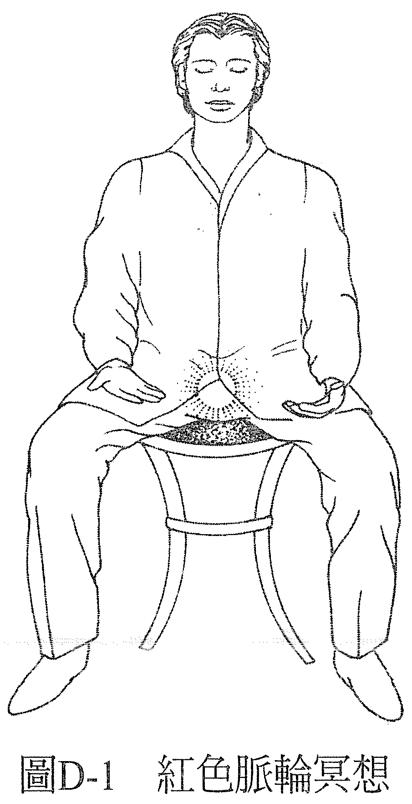
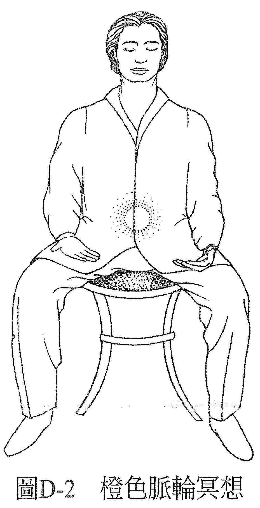
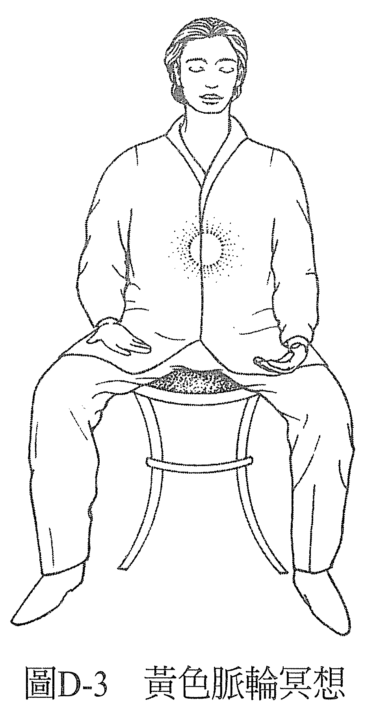
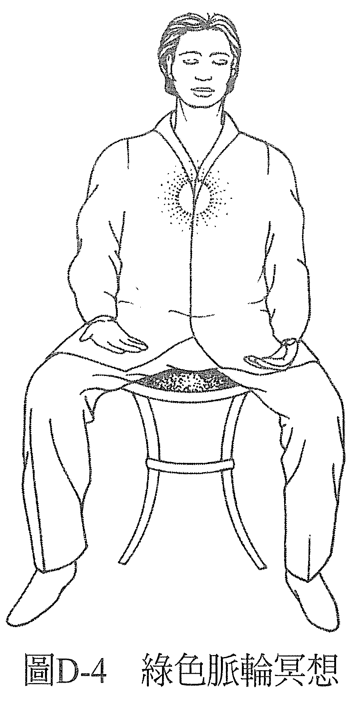
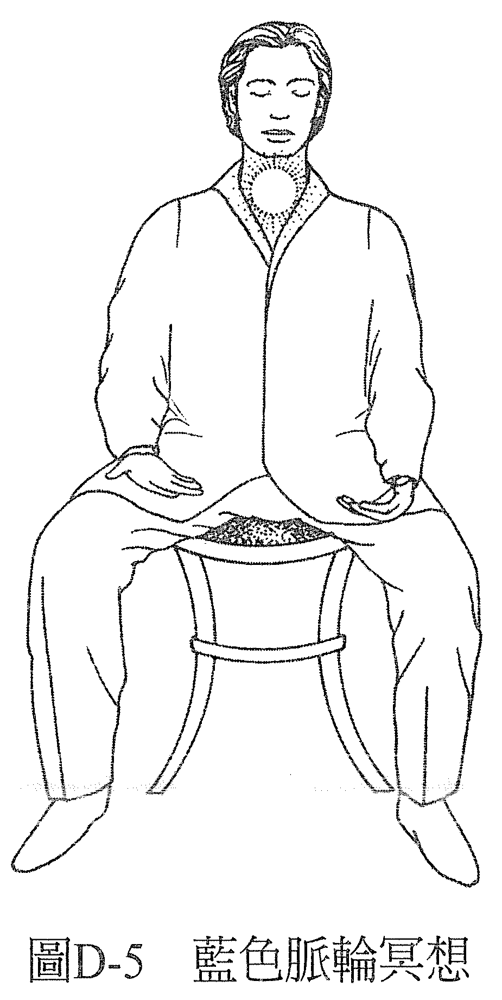
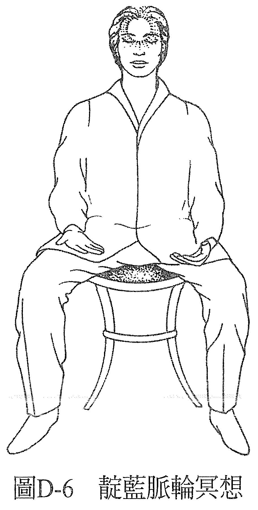
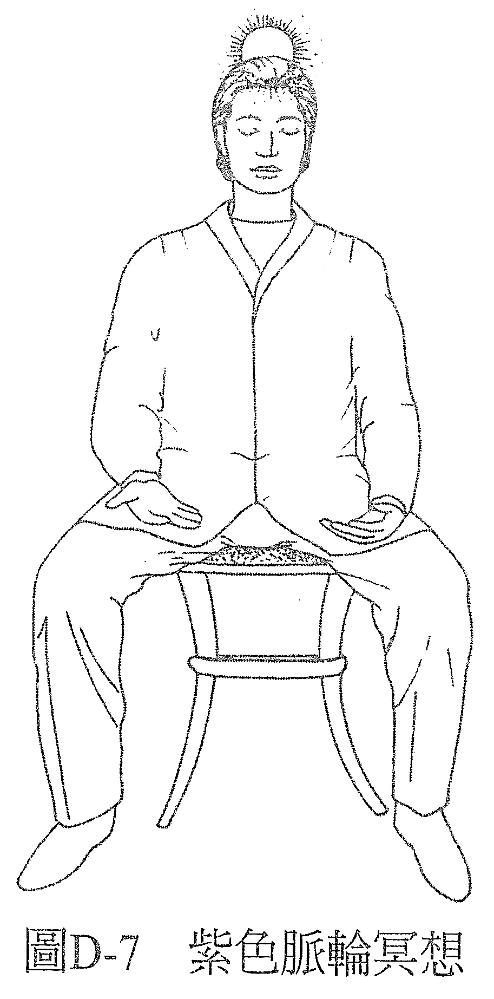

# 练习 D——脉轮冥想

这一次，你要把注意力依次导向各个脉轮。先专注在身体的知觉上，然后再运用想象力也就是创造画面的能力，来创造出那里有颜色的感觉。想象与创造画面之间没什么不同，唯一的差别是多数人比较相信自己有想象的能力，而没有创造画面的能力。他们知道每个小孩都会想象，不过创造画面嘛……呃，就是另一回事了。

接下来会请你在不同的部位想象不同的颜色，不过你可能会觉得自己看到了其他的颜色，如果有这种情形，只要留意你感觉到的其他颜色是什么，然后放掉它，用原本该有的颜色取代即可。你可以想象你用这个脉轮该有的颜色照耀它，或是帮它画上该有的颜色，或想像那里有个东西，而它有这个脉轮该有的颜色。最后，你会创造出一种各个部位都有该有的颜色之感，也会感受到整个经历的效果。

若你的感想是颜色与该有的不同，那这个不一样的颜色会指出你这个部分的意识现在是什么情况。可参考本书第六部之附录 4「色彩的语言索引」，看看就我们对健全概念的模型而言，你所看见的颜色代表了什么，图表里的叙述是否吻合你对自己意识现况的认知。

现在，找一个舒服的姿势做以下的冥想：

首先，将注意力导向会阴，以及你在这里感觉到的身体知觉。你会感觉到一些东西，然后认定你感觉到的是能量，还有这股能量正在焕发红色的光。如果你感觉到它是别的颜色，就注意是什么颜色，然后放掉它，把它变成红色。最后的感觉要是澄澈的红色能量球，就位于你所知的红色脉轮处。把注意力集中在这里，做个几分钟（见图 D-1）。

接着，把注意力往上移动大约十公分的位即腹腔的中心，以及你在这里感觉到的身体知觉。你会感觉到一些东西，然后认定你感觉到的是能量。

然后，认定这个能量正在焕发橙色的光。如果你感觉它是别的颜色，就注意是什么颜色，然后放掉它，把它变成橙色。最后，你的感觉是澄澈的红色能量球，就位于你所知的橙色脉轮处。把注意力集中在这里，做个几分钟（见图 D-2）。

现在，把注意力移动到太阳神经丛脉轮。去觉察这里有什么感知。你会感觉到一些东西，然后认定你感觉到的是能量，这个能量正在焕发黄色的光。如果你感觉它是别的颜色，就注意是什么颜色，然后放掉它，把它变成黄色。最后的感觉是澄澈的黄色能量球，位于你所知的黄色脉轮处。把注意力集中在这里，感觉个几分钟（见图 D-3）。

现在，将注意力移动到胸腔中间，即你所知的绿色脉轮所在之处。去觉察这里有什么感知。你会感觉到一些东西，然后认定你感觉到的是能量，这个能量正在焕发翠绿的光。如果你感觉它是别的颜色，就注意是什么颜色，然后放掉它，把它变成翠绿色。最后，感觉到的是澄澈的翠绿色能量球，就位于你所知的绿色脉轮处。把注意力集中在这里几分钟，感觉一下（见图 D-4）。

现在，将注意力移动到喉咙根部。去觉察这里有什么感知。在你所知的蓝色脉轮所在处，你会感觉到一些东西，然后认定你感觉到的是能量，这个能量正焕发着蓝色的光，是天空般的蓝色。若你感觉它是别种颜色，就注意是什么颜色，然后放掉它，改变它。决定它现在是天空蓝。最后的感觉是澄澈的天空蓝能量球，花一点时间维持这个感觉（见图 D-5) 。

接着，将注意力放在额头的中心点，去觉察这里有什么感知。在你所知的靛蓝脉轮所在处，你会感觉到一些东西，然后认定你感觉到的是能量，这个能量正在焕发靛蓝色的光，颜色是午夜蓝。如果你感觉它是别种颜色，就注意是什么颜色，然后放掉它，改变它。决定它现在是午夜蓝，并花几分钟的时间，在你的靛蓝脉轮维持有一个靛蓝色能量球的感觉（见图 D-6）。

现在注意力移动到了头顶，在你所知的紫色脉轮所在处，去觉察有什么感知。你会感觉到一些东西，然后认定你感觉到的是能量，这个能量正焕发着紫色的光，如紫水晶那般的紫色。若你感觉它是别的颜色，就注意是什么颜色，然后改变它。把它变成紫色，最后花几分钟的时间，在你的紫色脉轮维持有一个紫色能量球在发光的感觉（见图 D-7）。

最后，完全地放松，留意冥想后和冥想前相比，你经验到什么不一样的状态。你无疑会注意到有些地方感觉变得更好了，透过这次的经验，你会体会到这个冥想的好处。

该冥想不只帮助你在有需要的时候，重新回归自己的中心，也能让你检视你的意识刚才在做冥想之前经历过些什么，让你对你此刻的状态有个概念。你可以预期用这个冥想在自己身上下过功夫以后，所有失衡的情况都会得到修正，或是有某种程度上的改善。

用前面提及的「色彩的语言索引」分析你在各脉轮看到的颜色之后，将能检视出你目前的状态。如果你知道有些地方已经失衡了，例如你在身体上有些地方已经经历到一些症状，但你在这些地方只有看到它理论上该有的颜色，那么你就知道，你对自己的感知并未反映出真实，只反映出了你想要的样子。不管在什么时候，对自己当下状态的认知都不该有自我朦骗的成分，不然你内心深处那个知道该如何改善失衡之处的机制，就将无法运作。

认识自己，认识自己的真相。接纳它。其他一切都由此开始。

——记得，在这个世界上，一切都可以疗愈！——
